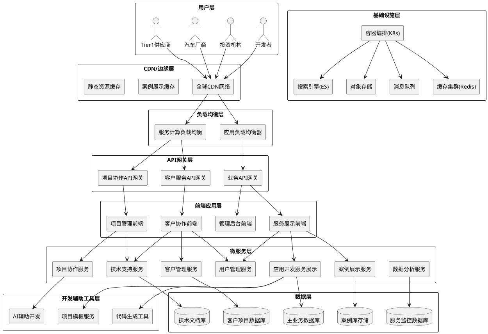
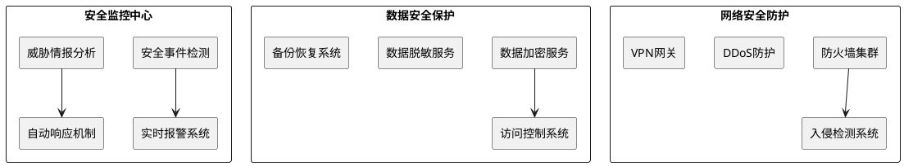
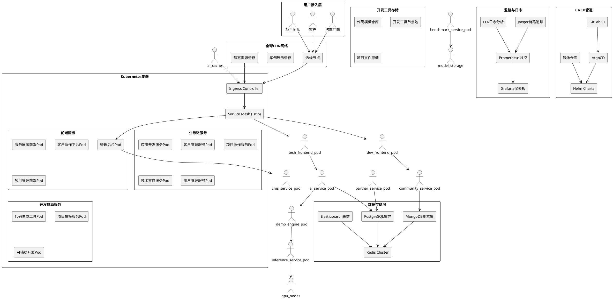

# 车载应用开发服务公司门户网站系统架构设计文档

## 1. 文档信息

| 项目 | 内容 |
|------|------|
| 文档名称 | 车载应用开发服务公司门户网站系统架构设计文档 |
| 文档版本 | v3.0 |
| 创建日期 | 2025-07-28 |
| 最后更新 | 2025-07-28 |
| 作者 | 架构设计团队 |
| 审核人 | 技术总监、产品总监 |

## 2. 架构设计目标

### 2.1 技术目标
- 构建支持车载应用开发服务的高性能门户系统
- 实现项目管理和协作平台的可靠运行
- 支持客户服务和技术支持的高并发访问
- 保证车载行业级别的安全性和合规性
- 实现微服务架构，支持服务模块的独立部署和扩展

### 2.2 业务目标
- 支持应用开发服务能力的全面展示和案例演示
- 提供项目协作平台和客户服务管理系统
- 建立客户成功案例和合作伙伴展示平台
- 支持B2B客户的项目需求提交和评估流程
- 实现高效的团队协作和客户沟通系统

### 2.3 车载应用开发行业特殊要求
- **功能安全合规**：符合ISO 26262功能安全标准的开发流程支撑
- **信息安全保护**：遵循ISO/SAE 21434信息安全标准的数据保护
- **数据隐私合规**：满足GDPR和国内数据安全法的客户数据保护
- **开发标准兼容**：支持AUTOSAR、Android Automotive等平台的开发流程
- **服务质量监控**：车载应用开发服务质量的实时监控和报告

## 3. 车载应用开发服务门户架构概览

### 3.1 整体架构图

### 3.2 核心架构特点

#### 3.2.1 微服务架构设计
- **应用开发服务展示**：负责服务能力展示、案例演示、开发流程可视化
- **客户管理服务**：客户关系管理、项目需求收集、合同管理
- **项目协作服务**：项目管理、任务分配、进度跟踪、交付管理
- **技术支持服务**：客户技术支持、问题跟踪、知识库管理
- **案例展示服务**：成功案例展示、客户证言、项目成果管理
- **用户管理服务**：统一身份认证、权限管理、用户画像分析

#### 3.2.2 开发辅助工具架构
- **代码生成工具**：基于模板的快速代码生成，提升开发效率
- **项目模板服务**：标准化项目模板，确保开发质量和一致性
- **AI辅助开发**：智能代码补全、自动化测试、代码质量检查

#### 3.2.3 数据架构设计
- **多数据库策略**：根据业务特点选择合适的数据存储方案
- **数据安全隔离**：客户项目数据与展示数据物理隔离
- **实时数据同步**：支持项目进度、客户反馈的实时同步和一致性保证

### 3.3 车载应用开发行业架构适配

#### 3.3.1 车载开发标准兼容性
- **AUTOSAR架构支持**：支持AUTOSAR平台的应用开发流程
- **Android Automotive集成**：专业的Android Automotive应用开发
- **QNX系统适配**：支持QNX平台的应用开发和集成
- **硬件抽象层**：适配主流车载芯片平台的应用开发

#### 3.3.2 功能安全架构
- **ASIL等级支持**：满足ASIL A到ASIL D不同安全等级要求
- **安全监控机制**：实时监控系统安全状态和故障诊断
- **冗余设计**：关键服务的主备切换和故障恢复机制
- **安全通信**：端到端的安全通信协议和数据加密

#### 3.3.3 实时性能保证
- **确定性调度**：保证关键任务的实时性响应
- **低延迟架构**：毫秒级的系统响应和数据处理
- **性能监控**：实时监控系统性能指标和资源使用情况
- **动态优化**：基于负载情况的动态资源分配和优化

## 4. 车载AI门户应用架构设计

### 4.1 应用架构图

```plantuml
@startuml
skinparam packageStyle rectangle

package "应用开发服务展示应用" {
  rectangle "服务能力展示模块" as service_viz
  rectangle "开发流程演示" as process_demo
  rectangle "工具链展示模块" as toolchain_display
  rectangle "技术方案模块" as solution_docs
  rectangle "成功案例管理" as case_mgmt
}

package "客户协作应用" {
  rectangle "项目协作平台" as project_collab
  rectangle "需求管理模块" as req_mgmt
  rectangle "进度跟踪模块" as progress_track
  rectangle "客户沟通模块" as client_comm
  rectangle "文档共享中心" as doc_share
}

package "客户管理应用" {
  rectangle "客户信息管理" as client_info
  rectangle "项目管理系统" as project_mgmt
  rectangle "合同管理系统" as contract_mgmt
  rectangle "需求评估系统" as req_eval
  rectangle "服务质量跟踪" as quality_track
}

package "技术支持应用" {
  rectangle "工单管理系统" as ticket_mgmt
  rectangle "知识库管理" as knowledge_base
  rectangle "远程支持工具" as remote_support
  rectangle "FAQ管理系统" as faq_mgmt
  rectangle "客户培训平台" as training_platform
}

package "用户管理应用" {
  rectangle "身份认证中心" as identity_center
  rectangle "权限管理系统" as permission_sys
  rectangle "客户画像分析" as client_profile
  rectangle "访问行为分析" as access_track
  rectangle "个性化服务" as personalization
}

package "数据分析应用" {
  rectangle "服务监控仪表板" as monitoring_dashboard
  rectangle "项目指标分析" as project_metrics
  rectangle "客户满意度分析" as satisfaction_analytics
  rectangle "服务质量监控" as quality_monitoring
  rectangle "报表生成引擎" as report_engine
}

package "通用服务层" {
  rectangle "API网关服务" as api_gateway_service
  rectangle "消息通知服务" as notification_service
  rectangle "文件上传服务" as file_upload_service
  rectangle "搜索引擎服务" as search_service
  rectangle "缓存管理服务" as cache_service
}

' 连接关系
service_viz --> api_gateway_service
process_demo --> api_gateway_service
project_collab --> notification_service
req_mgmt --> search_service
client_info --> file_upload_service
project_mgmt --> notification_service
ticket_mgmt --> knowledge_base
identity_center --> cache_service
client_profile --> satisfaction_analytics
monitoring_dashboard --> project_metrics

@enduml
```

### 4.2 核心应用模块设计

#### 4.2.1 应用开发服务展示应用
- **服务能力展示模块**：全栈开发能力、技术栈和工具链的可视化展示
- **开发流程演示**：标准化开发流程、质量保证体系的演示和介绍
- **工具链展示模块**：自研开发工具、AI辅助工具的功能演示
- **技术方案模块**：开发方法论、最佳实践和技术规范管理
- **成功案例管理**：客户项目案例、开发成果和效果展示

#### 4.2.2 客户协作应用
- **项目协作平台**：在线项目管理、任务分配和进度跟踪系统
- **需求管理模块**：客户需求收集、分析和规格定义流程
- **进度跟踪模块**：项目里程碑、交付物和质量监控功能
- **客户沟通模块**：即时通讯、视频会议和问题反馈系统
- **文档共享中心**：项目文档、设计资料和代码的安全共享

#### 4.2.3 客户管理应用
- **客户信息管理**：客户档案、联系人和合作历史的综合管理
- **项目管理系统**：项目立项、资源分配和执行监控功能
- **合同管理系统**：合同签署、执行跟踪和变更管理流程
- **需求评估系统**：项目需求评估、技术可行性分析和报价
- **服务质量跟踪**：客户满意度、服务评价和改进建议收集

#### 4.2.4 智能化服务特性
- **个性化服务**：基于客户画像和项目特点的定制化服务推荐
- **智能搜索**：支持语义搜索和智能问答的技术知识检索
- **服务质量监控**：项目质量、交付效率和客户满意度的实时监控
- **AI辅助决策**：基于历史数据的项目风险评估和资源优化建议

## 5. 车载应用开发服务门户数据架构设计

### 5.1 数据库设计图

```plantuml
@startuml

entity "用户表" as users {
    * id : int [PK]
    --
    username : string
    email : string
    password_hash : string
    user_type : enum ['OEM', 'Tier1', 'Developer', 'Investor', 'Admin']
    company_name : string
    position : string
    phone : string
    country : string
    created_at : datetime
    updated_at : datetime
    last_login_at : datetime
}

entity "客户资料表" as client_profiles {
    * user_id : int [PK, FK]
    --
    contact_person : string
    department : string
    business_requirements : text
    preferred_contact_method : enum ['Email', 'Phone', 'WeChat']
    project_budget_range : string
    cooperation_history : text
}

entity "公司信息表" as company_info {
    * id : int [PK]
    --
    company_name : string
    company_type : enum ['OEM', 'Tier1', 'SystemIntegrator', 'Startup']
    industry : string
    scale : enum ['Small', 'Medium', 'Large', 'Enterprise']
    country : string
    website : string
    description : text
    logo_url : string
}

entity "项目信息表" as project_info {
    * id : int [PK]
    --
    project_name : string
    client_id : int [FK]
    project_type : enum ['App Development', 'System Integration', 'UI/UX Design', 'Testing']
    description : text
    technology_stack : json
    budget : decimal
    start_date : date
    end_date : date
    status : enum ['Planning', 'Development', 'Testing', 'Delivered', 'Maintenance']
    project_manager_id : int [FK]
    created_at : datetime
    updated_at : datetime
}

entity "开发案例表" as development_cases {
    * id : int [PK]
    --
    case_title : string
    description : text
    case_type : enum ['Navigation App', 'Entertainment System', 'Voice Assistant', 'Vehicle Control']
    technology_stack : json
    client_name : string
    project_duration : string
    team_size : int
    achievements : text
    screenshots_url : json
    client_testimonial : text
    is_featured : boolean
    created_at : datetime
}

entity "客户反馈表" as client_feedback {
    * id : int [PK]
    --
    client_id : int [FK]
    project_id : int [FK]
    feedback_type : enum ['Requirement', 'Issue', 'Improvement', 'Satisfaction']
    title : string
    content : text
    priority : enum ['Low', 'Medium', 'High', 'Critical']
    status : enum ['Open', 'In Progress', 'Resolved', 'Closed']
    assigned_to : int [FK]
    created_at : datetime
    updated_at : datetime
}

entity "项目文档表" as project_documents {
    * id : int [PK]
    --
    project_id : int [FK]
    title : string
    content : text
    doc_type : enum ['Requirement', 'Design', 'Technical', 'User Manual', 'Report']
    version : string
    author_id : int [FK]
    access_level : enum ['Public', 'Client', 'Internal']
    file_url : string
    download_count : int
    created_at : datetime
    updated_at : datetime
}

entity "客户表" as clients {
    * id : int [PK]
    --
    company_name : string
    client_type : enum ['OEM', 'Tier1', 'SystemIntegrator', 'Startup']
    cooperation_level : enum ['Strategic', 'Regular', 'Potential']
    logo_url : string
    website : string
    description : text
    contact_info : json
    status : enum ['Active', 'Pending', 'Inactive']
    signed_at : datetime
}

entity "服务评价表" as service_reviews {
    * id : int [PK]
    --
    client_id : int [FK]
    project_id : int [FK]
    rating : decimal
    review_title : string
    review_content : text
    service_aspects : json
    improvements_suggested : text
    would_recommend : boolean
    is_public : boolean
    created_at : datetime
}

entity "项目需求申请表" as project_requests {
    * id : int [PK]
    --
    applicant_id : int [FK]
    company_id : int [FK]
    project_title : string
    project_description : text
    technical_requirements : json
    expected_outcomes : text
    timeline : string
    budget_range : string
    status : enum ['Submitted', 'Under_Review', 'Approved', 'Rejected', 'In_Progress', 'Completed']
    assigned_pm : int [FK]
    created_at : datetime
    updated_at : datetime
}

entity "技术支持工单表" as support_tickets {
    * id : int [PK]
    --
    requester_id : int [FK]
    title : string
    description : text
    priority : enum ['Low', 'Medium', 'High', 'Critical']
    category : enum ['Technical', 'Account', 'Billing', 'Feature_Request']
    status : enum ['Open', 'In_Progress', 'Resolved', 'Closed']
    assigned_to : int [FK]
    resolution : text
    created_at : datetime
    resolved_at : datetime
}

entity "文档下载记录表" as document_downloads {
    * id : int [PK]
    --
    user_id : int [FK]
    document_type : enum ['Technical_Doc', 'Case_Study', 'Service_Guide', 'Report']
    document_id : int
    document_name : string
    file_size : bigint
    download_ip : string
    user_agent : string
    created_at : datetime
}

' 关系定义
users ||--o{ client_profiles
users ||--o{ client_feedback
users ||--o{ project_documents
users ||--o{ project_requests
users ||--o{ support_tickets
users ||--o{ document_downloads

company_info ||--o{ project_requests
clients ||--o{ project_info
clients ||--o{ service_reviews

project_info ||--o{ client_feedback
project_info ||--o{ project_documents
project_info ||--o{ service_reviews

development_cases ||--o{ service_reviews

@enduml
```

### 5.2 数据架构特点

#### 5.2.1 多维客户体系设计
- **客户类型分层**：根据汽车行业特点，将客户分为OEM、Tier1、系统集成商、初创公司等类型
- **客户资料扩展**：专门为企业客户设计的需求、预算和合作历史管理
- **公司信息管理**：针对B2B服务的客户公司信息和合作关系管理

#### 5.2.2 项目资产管理
- **项目信息管理**：结构化管理客户项目的全生命周期信息
- **开发案例管理**：支持成功案例展示和客户证言管理
- **文档版本控制**：项目文档的版本管理和访问权限控制

#### 5.2.3 服务业务流程支持
- **项目需求管理**：从需求申请到项目交付的完整业务流程管理
- **客户服务体系**：工单系统、反馈收集和服务质量跟踪
- **数据分析支持**：客户行为、项目绩效和服务质量的数据收集

## 6. 技术栈选择

### 6.1 前端技术栈

#### 6.1.1 核心框架
- **React 18+**：现代化的前端框架，支持并发特性和服务端渲染
- **Next.js 14+**：全栈React框架，提供SSR/SSG、路由和API支持
- **TypeScript 5+**：类型安全的JavaScript，提高代码质量和维护性

#### 6.1.2 UI组件库
- **Ant Design 5.x**：企业级UI设计语言和组件库
- **Tailwind CSS 3.x**：原子化CSS框架，快速构建现代化界面
- **Framer Motion**：动画库，提供流畅的交互动效

#### 6.1.3 状态管理与数据
- **Redux Toolkit**：状态管理，简化Redux使用
- **React Query/TanStack Query**：服务端状态管理和缓存
- **Zustand**：轻量级状态管理，适用于局部状态

#### 6.1.4 可视化与AI展示
- **D3.js**：数据可视化库，用于AI算法效果展示
- **Three.js**：3D图形库，用于车载环境模拟
- **Chart.js/Recharts**：图表库，用于性能指标展示
- **Monaco Editor**：代码编辑器，支持语法高亮和智能提示

### 6.2 后端技术栈

#### 6.2.1 核心框架
- **Node.js 20+ LTS**：高性能JavaScript运行时
- **Express.js/Fastify**：Web应用框架，提供RESTful API
- **NestJS**：企业级Node.js框架，支持微服务架构

#### 6.2.2 数据库与存储
- **PostgreSQL 15+**：关系型数据库，支持JSON和复杂查询
- **MongoDB 7.x**：文档数据库，用于非结构化数据存储
- **Redis 7.x**：内存数据库，用于缓存和会话存储
- **Elasticsearch 8.x**：搜索引擎，用于技术文档和内容搜索

#### 6.2.3 AI与计算服务
- **Python 3.11+**：AI算法开发和模型推理
- **PyTorch/TensorFlow**：深度学习框架
- **ONNX Runtime**：跨平台模型推理引擎
- **CUDA/OpenVINO**：GPU加速计算

#### 6.2.4 消息与队列
- **Apache Kafka**：高吞吐量消息队列，用于实时数据处理
- **RabbitMQ**：消息中间件，用于异步任务处理
- **Apache Pulsar**：云原生消息队列，支持多租户

### 6.3 基础设施技术栈

#### 6.3.1 容器化与编排
- **Docker**：应用容器化
- **Kubernetes**：容器编排和管理
- **Helm**：Kubernetes包管理器
- **Istio**：服务网格，提供微服务治理

#### 6.3.2 CI/CD与监控
- **GitLab CI/GitHub Actions**：持续集成和部署
- **ArgoCD**：GitOps部署工具
- **Prometheus + Grafana**：监控和可视化
- **ELK Stack**：日志收集、分析和可视化

#### 6.3.3 安全与合规
- **HashiCorp Vault**：密钥管理和安全存储
- **OWASP ZAP**：安全测试工具
- **SonarQube**：代码质量和安全分析
- **Falco**：运行时安全监控

### 6.4 车载行业专用技术

#### 6.4.1 车载标准支持
- **AUTOSAR架构**：经典平台和自适应平台支持
- **Android Automotive OS**：Google车载操作系统
- **QNX Hypervisor**：实时操作系统支持
- **ROS 2**：机器人操作系统，用于自动驾驶开发

#### 6.4.2 通信协议
- **CAN/CAN-FD**：车载网络通信协议
- **Automotive Ethernet**：车载以太网通信
- **MQTT**：物联网消息协议
- **DDS**：数据分发服务，用于实时通信

#### 6.4.3 功能安全工具
- **ASPICE工具链**：软件过程改进和能力评估
- **Vector CANoe**：车载网络开发和测试
- **dSPACE工具链**：实时仿真和硬件在环测试
- **LDRA工具套件**：静态分析和代码覆盖率测试

## 7. 车载行业安全架构设计

### 7.1 功能安全架构

#### 7.1.1 ISO 26262合规设计
- **ASIL等级分层**：根据功能安全要求实现不同ASIL等级的隔离和保护
- **安全监控机制**：实时监控系统状态，及时发现和处理安全事件
- **故障诊断系统**：自动检测系统故障并启动相应的安全措施
- **冗余设计**：关键服务的多重备份和故障切换机制

#### 7.1.2 实时安全监控

### 7.2 信息安全架构

#### 7.2.1 数据保护策略
- **数据分类分级**：根据敏感程度对数据进行分类和差异化保护
- **端到端加密**：从数据产生到消费的全链路加密保护
- **零信任架构**：不信任任何内外部访问，严格验证每个访问请求
- **隐私计算**：支持数据不出域的安全计算和分析

#### 7.2.2 身份认证与授权
- **多因子认证**：支持短信、邮箱、硬件令牌等多种认证方式
- **单点登录(SSO)**：统一身份认证，减少密码泄露风险
- **细粒度权限控制**：基于角色和属性的访问控制(RBAC+ABAC)
- **会话管理**：安全的会话创建、维护和销毁机制

## 8. 云原生部署架构设计

### 8.1 部署架构图

### 8.2 云原生架构特点

#### 8.2.1 容器化与编排
- **Kubernetes原生**：全面基于Kubernetes的容器编排和管理
- **微服务架构**：业务功能拆分为独立可扩展的微服务
- **服务网格**：使用Istio实现服务间通信、安全和可观测性
- **弹性伸缩**：基于负载自动扩缩容，支持突发流量

#### 8.2.2 开发工具优化
- **开发工具节点池**：专用节点支持开发工具和代码生成服务
- **模板管理**：统一的项目模板仓库和版本管理
- **任务调度**：智能调度开发任务到最优节点
- **缓存优化**：多级缓存加速案例展示和项目数据访问

#### 8.2.3 数据存储策略
- **多数据库架构**：根据业务特点选择最适合的数据库类型
- **读写分离**：数据库集群支持读写分离和负载均衡
- **数据备份**：自动化数据备份和跨地域容灾
- **搜索优化**：Elasticsearch支持全文搜索和日志分析

### 8.3 高可用性保证

#### 8.3.1 多层容错设计
- **多可用区部署**：跨多个可用区部署确保高可用性
- **故障自愈**：Pod故障自动重启，节点故障自动调度
- **流量切换**：基于健康检查的自动流量切换
- **数据冗余**：关键数据多副本存储

#### 8.3.2 性能监控与优化
- **全方位监控**：应用、基础设施、业务指标的全面监控
- **链路追踪**：分布式系统的端到端链路追踪
- **智能告警**：基于机器学习的异常检测和预警
- **性能优化**：实时性能分析和自动优化建议

## 9. 运维与DevOps流程

### 9.1 CI/CD流程设计

#### 9.1.1 持续集成
- **代码提交触发**：Git提交自动触发构建流程
- **多环境测试**：开发、测试、预生产环境的自动化测试
- **质量门禁**：代码质量、安全扫描、测试覆盖率检查
- **镜像构建**：自动构建和推送Docker镜像

#### 9.1.2 持续部署
- **GitOps模式**：基于Git仓库的声明式部署
- **滚动更新**：零停机时间的应用更新
- **蓝绿部署**：关键服务的蓝绿部署策略
- **回滚机制**：快速回滚到上一个稳定版本

### 9.2 运维自动化

#### 9.2.1 基础设施即代码
- **Terraform**：基础设施的版本化管理
- **Ansible**：配置管理和自动化运维
- **Helm Charts**：Kubernetes应用的包管理
- **GitOps工作流**：基于Git的运维流程管理

#### 9.2.2 监控告警体系
- **业务监控**：用户体验、业务指标的实时监控
- **技术监控**：系统性能、资源使用的监控
- **安全监控**：安全事件、异常行为的监控
- **智能告警**：分级告警、自动故障定位

### 9.3 成本优化策略

#### 9.3.1 资源优化
- **弹性伸缩**：根据负载自动调整资源配置
- **Spot实例**：使用竞价实例降低计算成本
- **资源池化**：GPU等昂贵资源的池化管理
- **成本分析**：详细的成本分析和优化建议

#### 9.3.2 技术债务管理
- **定期重构**：持续的代码重构和技术栈升级
- **性能调优**：定期的性能分析和优化
- **安全更新**：及时的安全补丁和漏洞修复
- **文档维护**：技术文档的持续更新和完善