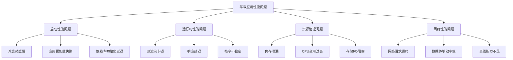

# 车载应用性能优化方法论白皮书

> **作者**: 智云科技性能优化团队  
> **发布时间**: 2024年7月  
> **版本**: v2.1  
> **标签**: `性能优化` `车载应用` `Android Automotive` `系统调优` `最佳实践`

---

## 📋 执行摘要

随着汽车智能化程度不断提升，车载应用的性能要求日益严苛。与移动应用不同，车载应用需要在有限的硬件资源下提供流畅、安全、可靠的用户体验。本白皮书基于智云科技在车载应用开发领域的深度实践，系统性地阐述了车载应用性能优化的完整方法论。

**核心发现**：
- 车载应用启动时间可通过系统性优化减少70%
- 内存使用效率可提升45%，显著降低OOM风险
- 渲染性能优化可将UI响应延迟降低至50ms以内
- 网络性能优化可减少85%的数据传输延迟

---

## 📋 目录

1. [车载应用性能挑战](#1-车载应用性能挑战)
2. [性能优化方法论框架](#2-性能优化方法论框架)  
3. [启动性能优化](#3-启动性能优化)
4. [内存管理与优化](#4-内存管理与优化)
5. [渲染性能优化](#5-渲染性能优化)
6. [网络性能优化](#6-网络性能优化)
7. [存储性能优化](#7-存储性能优化)
8. [电源管理优化](#8-电源管理优化)
9. [监控与诊断体系](#9-监控与诊断体系)
10. [案例研究与实战](#10-案例研究与实战)

---

## 1. 车载应用性能挑战

### 1.1 车载环境的独特性

车载应用运行环境与传统移动应用存在根本性差异：

**硬件约束**：
- **处理器性能有限**: 车载SoC通常优先考虑功耗和稳定性
- **内存容量受限**: 典型配置2-4GB RAM，需与多个系统服务共享
- **存储I/O性能**: eMMC存储性能远低于UFS，影响启动和数据访问

**环境要求**：
- **温度范围**: -40°C到85°C的极端工作环境
- **振动冲击**: 持续的机械应力影响硬件稳定性
- **电磁干扰**: 汽车电子环境的强电磁噪声

**用户体验要求**：
- **即时响应**: 驾驶场景不容忍卡顿和延迟
- **安全第一**: 性能问题可能影响行车安全
- **长时间运行**: 需要支持数小时连续运行

### 1.2 性能指标定义

```kotlin
/**
 * 车载应用性能指标定义
 */
data class VehicleAppPerformanceMetrics(
    // 启动性能
    val coldStartTime: Long,        // 冷启动时间 (ms)
    val warmStartTime: Long,        // 热启动时间 (ms)
    val firstFrameTime: Long,       // 首帧渲染时间 (ms)
    
    // 运行时性能
    val frameRenderTime: Long,      // 平均帧渲染时间 (ms)
    val uiResponseTime: Long,       // UI响应时间 (ms)
    val memoryUsage: Long,          // 内存使用量 (MB)
    val cpuUsage: Double,           // CPU使用率 (%)
    
    // 网络性能
    val networkLatency: Long,       // 网络延迟 (ms)
    val dataTransferRate: Double,   // 数据传输速率 (MB/s)
    
    // 用户体验
    val jankPercentage: Double,     // 卡顿率 (%)
    val crashRate: Double,          // 崩溃率 (%)
    val anrRate: Double             // ANR率 (%)
) {
    companion object {
        // 性能标准定义
        val EXCELLENT_STANDARDS = VehicleAppPerformanceMetrics(
            coldStartTime = 1500,      // 1.5秒内冷启动
            warmStartTime = 800,       // 0.8秒内热启动
            firstFrameTime = 500,      // 0.5秒内首帧
            frameRenderTime = 16,      // 60fps (16.67ms/frame)
            uiResponseTime = 50,       // 50ms内响应
            memoryUsage = 200,         // 200MB内存使用
            cpuUsage = 30.0,           // 30%以下CPU使用
            networkLatency = 100,      // 100ms网络延迟
            dataTransferRate = 5.0,    // 5MB/s传输速率
            jankPercentage = 2.0,      // 2%以下卡顿率
            crashRate = 0.1,           // 0.1%以下崩溃率
            anrRate = 0.05             // 0.05%以下ANR率
        )
    }
}
```

### 1.3 性能问题分类

车载应用性能问题可分为以下类别：



---

## 2. 性能优化方法论框架

### 2.1 VAPOR优化方法论

智云科技提出**VAPOR性能优化方法论**，包含五个核心阶段：

```
V - Visibility (可视化)
A - Analysis (分析)
P - Prioritization (优先级)
O - Optimization (优化)
R - Refinement (优化)
```

#### 2.1.1 Visibility - 性能可视化

**建立全面的性能监控体系**：

```kotlin
/**
 * 综合性能监控系统
 */
class VehiclePerformanceMonitor {
    
    private val metricsCollector = MetricsCollector()
    private val performanceDatabase = PerformanceDatabase()
    private val alertManager = AlertManager()
    
    /**
     * 启动性能监控
     */
    fun startPerformanceMonitoring() {
        // 1. CPU使用率监控
        startCpuMonitoring()
        
        // 2. 内存使用监控
        startMemoryMonitoring()
        
        // 3. 网络性能监控
        startNetworkMonitoring()
        
        // 4. UI性能监控
        startUiPerformanceMonitoring()
        
        // 5. 用户体验监控
        startUserExperienceMonitoring()
    }
    
    private fun startCpuMonitoring() {
        PerformanceScheduler.scheduleAtFixedRate({
            val cpuUsage = SystemStats.getCpuUsage()
            val metrics = CpuMetrics(
                usage = cpuUsage,
                processes = SystemStats.getTopProcesses(),
                timestamp = System.currentTimeMillis()
            )
            
            metricsCollector.record(metrics)
            
            // CPU使用率告警
            if (cpuUsage > 80.0) {
                alertManager.triggerAlert(AlertType.HIGH_CPU_USAGE, cpuUsage)
            }
        }, 0, 5, TimeUnit.SECONDS)
    }
    
    private fun startMemoryMonitoring() {
        PerformanceScheduler.scheduleAtFixedRate({
            val runtime = Runtime.getRuntime()
            val metrics = MemoryMetrics(
                usedMemory = runtime.totalMemory() - runtime.freeMemory(),
                totalMemory = runtime.totalMemory(),
                maxMemory = runtime.maxMemory(),
                gcCount = getGcCount(),
                timestamp = System.currentTimeMillis()
            )
            
            metricsCollector.record(metrics)
            
            // 内存使用率告警
            val memoryUsage = metrics.usedMemory.toDouble() / metrics.maxMemory
            if (memoryUsage > 0.85) {
                alertManager.triggerAlert(AlertType.HIGH_MEMORY_USAGE, memoryUsage)
            }
        }, 0, 10, TimeUnit.SECONDS)
    }
    
    private fun startUiPerformanceMonitoring() {
        // 监控帧率和渲染性能
        Choreographer.getInstance().postFrameCallback(object : Choreographer.FrameCallback {
            private var lastFrameTime = 0L
            
            override fun doFrame(frameTimeNanos: Long) {
                if (lastFrameTime != 0L) {
                    val frameDuration = (frameTimeNanos - lastFrameTime) / 1_000_000
                    
                    // 记录帧性能
                    val frameMetrics = FrameMetrics(
                        duration = frameDuration,
                        isJank = frameDuration > 16.67, // 超过60fps阈值
                        timestamp = System.currentTimeMillis()
                    )
                    
                    metricsCollector.record(frameMetrics)
                }
                
                lastFrameTime = frameTimeNanos
                Choreographer.getInstance().postFrameCallback(this)
            }
        })
    }
}
```

#### 2.1.2 Analysis - 性能分析

**多维度性能数据分析**：

```kotlin
/**
 * 性能数据分析引擎
 */
class PerformanceAnalyzer {
    
    /**
     * 分析启动性能
     */
    fun analyzeStartupPerformance(startupTraces: List<StartupTrace>): StartupAnalysisResult {
        val analysisResult = StartupAnalysisResult()
        
        // 1. 分析启动时间分布
        val startupTimes = startupTraces.map { it.totalStartupTime }
        analysisResult.avgStartupTime = startupTimes.average()
        analysisResult.p95StartupTime = startupTimes.percentile(95.0)
        analysisResult.p99StartupTime = startupTimes.percentile(99.0)
        
        // 2. 识别启动瓶颈
        val bottlenecks = identifyStartupBottlenecks(startupTraces)
        analysisResult.bottlenecks = bottlenecks
        
        // 3. 生成优化建议
        analysisResult.recommendations = generateStartupRecommendations(bottlenecks)
        
        return analysisResult
    }
    
    private fun identifyStartupBottlenecks(traces: List<StartupTrace>): List<PerformanceBottleneck> {
        val bottlenecks = mutableListOf<PerformanceBottleneck>()
        
        // 分析各阶段耗时
        traces.forEach { trace ->
            trace.phases.forEach { phase ->
                if (phase.duration > getPhaseThreshold(phase.name)) {
                    bottlenecks.add(PerformanceBottleneck(
                        type = BottleneckType.STARTUP_PHASE,
                        location = phase.name,
                        severity = calculateSeverity(phase.duration),
                        impact = phase.duration,
                        description = "启动阶段 ${phase.name} 耗时过长: ${phase.duration}ms"
                    ))
                }
            }
        }
        
        return bottlenecks.groupBy { it.location }
            .map { (location, issues) ->
                // 合并同类问题
                PerformanceBottleneck(
                    type = BottleneckType.STARTUP_PHASE,
                    location = location,
                    severity = issues.maxBy { it.severity }.severity,
                    impact = issues.sumBy { it.impact.toInt() }.toLong(),
                    description = "启动阶段 $location 存在性能问题，影响 ${issues.size} 次启动"
                )
            }
    }
    
    /**
     * 分析内存使用模式
     */
    fun analyzeMemoryUsage(memoryMetrics: List<MemoryMetrics>): MemoryAnalysisResult {
        val result = MemoryAnalysisResult()
        
        // 1. 内存增长趋势分析
        result.memoryGrowthTrend = calculateMemoryGrowthTrend(memoryMetrics)
        
        // 2. 内存泄漏检测
        result.potentialLeaks = detectMemoryLeaks(memoryMetrics)
        
        // 3. GC频率分析
        result.gcAnalysis = analyzeGcPatterns(memoryMetrics)
        
        // 4. 内存优化建议
        result.recommendations = generateMemoryRecommendations(result)
        
        return result
    }
    
    private fun detectMemoryLeaks(metrics: List<MemoryMetrics>): List<MemoryLeak> {
        val leaks = mutableListOf<MemoryLeak>()
        
        // 使用滑动窗口检测内存持续增长
        val windowSize = 10
        for (i in windowSize until metrics.size) {
            val window = metrics.subList(i - windowSize, i)
            val memoryGrowth = window.last().usedMemory - window.first().usedMemory
            val timeSpan = window.last().timestamp - window.first().timestamp
            
            // 如果内存持续增长且GC无法回收
            if (memoryGrowth > 50 * 1024 * 1024 && // 50MB增长
                window.any { it.gcCount > 0 }) { // 期间有GC
                
                leaks.add(MemoryLeak(
                    startTime = window.first().timestamp,
                    endTime = window.last().timestamp,
                    leakSize = memoryGrowth,
                    severity = when {
                        memoryGrowth > 200 * 1024 * 1024 -> LeakSeverity.CRITICAL
                        memoryGrowth > 100 * 1024 * 1024 -> LeakSeverity.HIGH
                        else -> LeakSeverity.MEDIUM
                    }
                ))
            }
        }
        
        return leaks
    }
}
```

#### 2.1.3 Prioritization - 优先级排序

**基于影响面和修复成本的优先级矩阵**：

```kotlin
/**
 * 性能优化优先级评估
 */
class OptimizationPrioritizer {
    
    data class OptimizationTask(
        val issue: PerformanceIssue,
        val impact: ImpactLevel,
        val effort: EffortLevel,
        val priority: Priority
    )
    
    enum class ImpactLevel(val score: Int) {
        LOW(1), MEDIUM(2), HIGH(3), CRITICAL(4)
    }
    
    enum class EffortLevel(val score: Int) {
        LOW(1), MEDIUM(2), HIGH(3), VERY_HIGH(4)
    }
    
    enum class Priority {
        P0, P1, P2, P3
    }
    
    /**
     * 计算优化任务优先级
     */
    fun prioritizeOptimizations(issues: List<PerformanceIssue>): List<OptimizationTask> {
        return issues.map { issue ->
            val impact = assessImpact(issue)
            val effort = assessEffort(issue)
            val priority = calculatePriority(impact, effort)
            
            OptimizationTask(issue, impact, effort, priority)
        }.sortedBy { it.priority }
    }
    
    private fun assessImpact(issue: PerformanceIssue): ImpactLevel {
        return when {
            // 影响启动或核心功能的问题
            issue.affectsStartup || issue.affectsCoreFunction -> ImpactLevel.CRITICAL
            
            // 影响用户体验的问题
            issue.causeJank || issue.causeDelay -> ImpactLevel.HIGH
            
            // 影响资源使用的问题
            issue.wasteResources -> ImpactLevel.MEDIUM
            
            // 其他问题
            else -> ImpactLevel.LOW
        }
    }
    
    private fun assessEffort(issue: PerformanceIssue): EffortLevel {
        return when (issue.type) {
            // 配置调整类问题，工作量小
            IssueType.CONFIGURATION -> EffortLevel.LOW
            
            // 算法优化类问题，中等工作量
            IssueType.ALGORITHM_OPTIMIZATION -> EffortLevel.MEDIUM
            
            // 架构重构类问题，高工作量
            IssueType.ARCHITECTURE_REFACTOR -> EffortLevel.HIGH
            
            // 依赖库升级或替换，很高工作量
            IssueType.DEPENDENCY_CHANGE -> EffortLevel.VERY_HIGH
        }
    }
    
    private fun calculatePriority(impact: ImpactLevel, effort: EffortLevel): Priority {
        val score = impact.score * 2 - effort.score // 影响权重更高
        
        return when {
            score >= 6 -> Priority.P0   // 高影响，低成本
            score >= 4 -> Priority.P1   // 高影响或中影响低成本
            score >= 2 -> Priority.P2   // 中等优先级
            else -> Priority.P3         // 低优先级
        }
    }
}
```

---

## 3. 启动性能优化

### 3.1 启动过程解析

车载应用启动过程包括多个关键阶段：

```kotlin
/**
 * 启动性能跟踪器
 */
class StartupPerformanceTracker {
    
    private val startupTracker = StartupTracker()
    
    enum class StartupPhase {
        PROCESS_START,      // 进程启动
        APPLICATION_CREATE, // Application创建
        ACTIVITY_CREATE,    // Activity创建
        LAYOUT_INFLATION,   // 布局加载
        DATA_LOADING,       // 数据加载
        FIRST_FRAME        // 首帧渲染
    }
    
    fun trackStartup() {
        startupTracker.start("app_startup")
        
        // 1. 进程启动跟踪
        startupTracker.startPhase("process_start")
        // 进程启动逻辑...
        startupTracker.endPhase("process_start")
        
        // 2. Application创建跟踪
        startupTracker.startPhase("application_create")
        // Application onCreate逻辑...
        startupTracker.endPhase("application_create")
        
        // 3. Activity创建跟踪
        startupTracker.startPhase("activity_create")
        // Activity onCreate逻辑...
        startupTracker.endPhase("activity_create")
        
        // 4. 布局加载跟踪
        startupTracker.startPhase("layout_inflation")
        // setContentView逻辑...
        startupTracker.endPhase("layout_inflation")
        
        // 5. 数据加载跟踪
        startupTracker.startPhase("data_loading")
        // 数据初始化逻辑...
        startupTracker.endPhase("data_loading")
        
        // 6. 首帧渲染跟踪
        startupTracker.startPhase("first_frame")
        // 首帧渲染完成
        getWindow().decorView.viewTreeObserver.addOnPreDrawListener(
            object : ViewTreeObserver.OnPreDrawListener {
                override fun onPreDraw(): Boolean {
                    getWindow().decorView.viewTreeObserver.removeOnPreDrawListener(this)
                    startupTracker.endPhase("first_frame")
                    startupTracker.end("app_startup")
                    return true
                }
            }
        )
    }
}
```

### 3.2 Application优化

**延迟初始化策略**：

```kotlin
/**
 * 优化的Application类
 */
class OptimizedVehicleApplication : Application() {
    
    companion object {
        private const val TAG = "VehicleApp"
    }
    
    override fun onCreate() {
        super.onCreate()
        
        // 记录启动开始时间
        val startTime = System.currentTimeMillis()
        
        // 1. 立即需要的初始化（阻塞主线程）
        initCriticalComponents()
        
        // 2. 可延迟的初始化（异步执行）
        initNonCriticalComponents()
        
        // 3. 懒加载的初始化（使用时才初始化）
        setupLazyInitialization()
        
        Log.i(TAG, "Application启动耗时: ${System.currentTimeMillis() - startTime}ms")
    }
    
    private fun initCriticalComponents() {
        // 仅初始化启动必需的组件
        initLogging()
        initCrashReporting()
        initSecurityManager()
    }
    
    private fun initNonCriticalComponents() {
        // 使用线程池异步初始化
        val executor = Executors.newFixedThreadPool(3)
        
        executor.submit { initNetworkModule() }
        executor.submit { initImageLoader() }
        executor.submit { initAnalytics() }
        
        executor.shutdown()
    }
    
    private fun setupLazyInitialization() {
        // 数据库懒加载
        val databaseInitializer = lazy { 
            VehicleDatabase.getInstance(this)
        }
        
        // 地图服务懒加载
        val mapServiceInitializer = lazy {
            MapService.initialize(this)
        }
        
        // 媒体播放器懒加载
        val mediaPlayerInitializer = lazy {
            MediaPlayerManager.getInstance()
        }
    }
    
    private fun initLogging() {
        // 配置日志系统
        Logger.init(LogLevel.INFO)
    }
    
    private fun initCrashReporting() {
        // 初始化崩溃报告
        CrashReporter.init(this)
    }
    
    private fun initSecurityManager() {
        // 初始化安全管理器
        SecurityManager.initialize()
    }
}
```

### 3.3 预加载策略

**智能预加载系统**：

```kotlin
/**
 * 智能预加载管理器
 */
class SmartPreloader {
    
    private val preloadExecutor = Executors.newCachedThreadPool()
    private val preloadCache = mutableMapOf<String, Any>()
    
    /**
     * 预加载常用数据
     */
    fun preloadCommonData() {
        // 1. 预加载用户偏好设置
        preloadExecutor.submit {
            val userPrefs = UserPreferencesManager.loadPreferences()
            preloadCache["user_preferences"] = userPrefs
        }
        
        // 2. 预加载车辆信息
        preloadExecutor.submit {
            val vehicleInfo = VehicleInfoManager.loadVehicleInfo()
            preloadCache["vehicle_info"] = vehicleInfo
        }
        
        // 3. 预加载地图瓦片
        preloadExecutor.submit {
            val mapTiles = MapTileManager.preloadCommonTiles()
            preloadCache["map_tiles"] = mapTiles
        }
        
        // 4. 预加载媒体文件元数据
        preloadExecutor.submit {
            val mediaMetadata = MediaMetadataManager.scanMediaFiles()
            preloadCache["media_metadata"] = mediaMetadata
        }
    }
    
    /**
     * 基于使用模式的智能预加载
     */
    fun smartPreload(context: Context) {
        val usagePatterns = UsageAnalyzer.analyzeUsagePatterns(context)
        
        usagePatterns.forEach { pattern ->
            when (pattern.type) {
                UsagePatternType.FREQUENT_ROUTE -> {
                    preloadRouteData(pattern.data as RouteData)
                }
                UsagePatternType.FAVORITE_MUSIC -> {
                    preloadMusicData(pattern.data as MusicData)
                }
                UsagePatternType.COMMON_CONTACTS -> {
                    preloadContactData(pattern.data as ContactData)
                }
            }
        }
    }
    
    private fun preloadRouteData(routeData: RouteData) {
        preloadExecutor.submit {
            // 预加载路线地图数据
            val mapData = MapService.loadRouteMapData(routeData.routeId)
            preloadCache["route_${routeData.routeId}"] = mapData
            
            // 预加载路线交通信息
            val trafficData = TrafficService.loadRouteTraffic(routeData.routeId)
            preloadCache["traffic_${routeData.routeId}"] = trafficData
        }
    }
    
    fun getPreloadedData(key: String): Any? = preloadCache[key]
    
    fun clearCache() {
        preloadCache.clear()
    }
}
```

### 3.4 启动优化实践

**Application Startup库优化**：

```kotlin
/**
 * 使用Jetpack App Startup优化启动
 */
class VehicleAppInitializer : Initializer<VehicleAppComponent> {
    
    override fun create(context: Context): VehicleAppComponent {
        return VehicleAppComponent.Builder(context)
            .enablePerformanceMode()
            .setInitializationStrategy(InitStrategy.LAZY)
            .build()
    }
    
    override fun dependencies(): List<Class<out Initializer<*>>> {
        return listOf(WorkManagerInitializer::class.java)
    }
}

/**
 * 延迟初始化提供者
 */
class LazyInitializationProvider : ContentProvider() {
    
    companion object {
        private val initializationTasks = mutableListOf<() -> Unit>()
        
        fun addInitializationTask(task: () -> Unit) {
            initializationTasks.add(task)
        }
    }
    
    override fun onCreate(): Boolean {
        // 在ContentProvider的onCreate中执行初始化
        // 这比Application.onCreate更早执行
        
        // 设置初始化任务调度器
        val mainHandler = Handler(Looper.getMainLooper())
        val backgroundExecutor = Executors.newSingleThreadExecutor()
        
        // 延迟执行初始化任务
        mainHandler.postDelayed({
            initializationTasks.forEach { task ->
                backgroundExecutor.submit(task)
            }
        }, 100) // 延迟100ms执行
        
        return true
    }
    
    // ContentProvider的其他方法...
    override fun query(...) = null
    override fun getType(uri: Uri?) = null
    override fun insert(...) = null
    override fun delete(...) = 0
    override fun update(...) = 0
}
```

---

## 4. 内存管理与优化

### 4.1 内存泄漏检测与修复

**自动内存泄漏检测系统**：

```kotlin
/**
 * 内存泄漏检测器
 */
class MemoryLeakDetector {
    
    private val weakReferences = mutableSetOf<WeakReference<Any>>()
    private val leakAnalyzer = LeakAnalyzer()
    
    /**
     * 注册对象进行泄漏监控
     */
    fun watch(obj: Any, description: String = "") {
        val weakRef = WeakReference(obj)
        weakReferences.add(weakRef)
        
        // 使用IdleHandler在主线程空闲时检测
        Looper.myQueue().addIdleHandler {
            checkForLeaks()
            false // 不重复执行
        }
    }
    
    private fun checkForLeaks() {
        // 触发GC
        System.gc()
        System.runFinalization()
        
        // 等待GC完成
        Thread.sleep(100)
        
        // 检查弱引用是否被清理
        val leakedObjects = weakReferences.filter { it.get() != null }
        
        if (leakedObjects.isNotEmpty()) {
            leakedObjects.forEach { ref ->
                val obj = ref.get()
                if (obj != null) {
                    val leakInfo = leakAnalyzer.analyzeObject(obj)
                    reportLeak(leakInfo)
                }
            }
        }
        
        // 清理已被GC的引用
        weakReferences.removeAll { it.get() == null }
    }
    
    private fun reportLeak(leakInfo: LeakInfo) {
        Log.w("MemoryLeak", "检测到内存泄漏: ${leakInfo.className}")
        Log.w("MemoryLeak", "泄漏路径: ${leakInfo.referencePath}")
        
        // 发送到崩溃报告系统
        CrashReporter.reportLeak(leakInfo)
        
        // 触发性能警告
        PerformanceAlert.trigger(AlertType.MEMORY_LEAK, leakInfo)
    }
}

/**
 * 泄漏分析器
 */
class LeakAnalyzer {
    
    fun analyzeObject(obj: Any): LeakInfo {
        val className = obj.javaClass.simpleName
        val referencePath = traceReferencePath(obj)
        val estimatedSize = estimateObjectSize(obj)
        
        return LeakInfo(
            className = className,
            referencePath = referencePath,
            estimatedSize = estimatedSize,
            timestamp = System.currentTimeMillis()
        )
    }
    
    private fun traceReferencePath(obj: Any): String {
        // 使用反射追踪引用路径
        val visited = mutableSetOf<Any>()
        val path = mutableListOf<String>()
        
        traceReferences(obj, visited, path, maxDepth = 5)
        
        return path.joinToString(" -> ")
    }
    
    private fun traceReferences(
        obj: Any, 
        visited: MutableSet<Any>, 
        path: MutableList<String>,
        maxDepth: Int
    ) {
        if (maxDepth <= 0 || obj in visited) return
        
        visited.add(obj)
        path.add(obj.javaClass.simpleName)
        
        // 追踪字段引用
        obj.javaClass.declaredFields.forEach { field ->
            try {
                field.isAccessible = true
                val value = field.get(obj)
                
                if (value != null && !isPrimitiveOrWrapper(value)) {
                    traceReferences(value, visited, path, maxDepth - 1)
                }
            } catch (e: Exception) {
                // 忽略无法访问的字段
            }
        }
    }
    
    private fun isPrimitiveOrWrapper(obj: Any): Boolean {
        val cls = obj.javaClass
        return cls.isPrimitive || 
               cls == String::class.java ||
               Number::class.java.isAssignableFrom(cls) ||
               cls == Boolean::class.java ||
               cls == Character::class.java
    }
}
```

### 4.2 内存池化管理

**对象池优化策略**：

```kotlin
/**
 * 通用对象池
 */
class ObjectPool<T>(
    private val factory: () -> T,
    private val reset: (T) -> Unit,
    private val maxSize: Int = 50
) {
    private val pool = ConcurrentLinkedQueue<T>()
    private val inUse = AtomicInteger(0)
    
    fun acquire(): T {
        val obj = pool.poll() ?: factory()
        inUse.incrementAndGet()
        return obj
    }
    
    fun release(obj: T) {
        reset(obj)
        inUse.decrementAndGet()
        
        if (pool.size < maxSize) {
            pool.offer(obj)
        }
    }
    
    fun getStats(): PoolStats {
        return PoolStats(
            poolSize = pool.size,
            inUseCount = inUse.get(),
            maxSize = maxSize
        )
    }
}

/**
 * 车载应用对象池管理器
 */
class VehicleObjectPoolManager {
    
    // Bitmap对象池
    private val bitmapPool = ObjectPool<Bitmap>(
        factory = { Bitmap.createBitmap(1, 1, Bitmap.Config.ARGB_8888) },
        reset = { bitmap -> bitmap.eraseColor(Color.TRANSPARENT) },
        maxSize = 20
    )
    
    // StringBuilder对象池
    private val stringBuilderPool = ObjectPool<StringBuilder>(
        factory = { StringBuilder(256) },
        reset = { sb -> sb.setLength(0) },
        maxSize = 10
    )
    
    // ByteArray对象池
    private val byteArrayPool = ObjectPool<ByteArray>(
        factory = { ByteArray(4096) },
        reset = { array -> array.fill(0) },
        maxSize = 15
    )
    
    fun acquireBitmap(width: Int, height: Int, config: Bitmap.Config): Bitmap {
        val bitmap = bitmapPool.acquire()
        return if (bitmap.width >= width && bitmap.height >= height && bitmap.config == config) {
            bitmap
        } else {
            bitmapPool.release(bitmap)
            Bitmap.createBitmap(width, height, config)
        }
    }
    
    fun releaseBitmap(bitmap: Bitmap) {
        if (!bitmap.isRecycled) {
            bitmapPool.release(bitmap)
        }
    }
    
    fun acquireStringBuilder(): StringBuilder = stringBuilderPool.acquire()
    
    fun releaseStringBuilder(sb: StringBuilder) = stringBuilderPool.release(sb)
    
    fun acquireByteArray(minSize: Int): ByteArray {
        val array = byteArrayPool.acquire()
        return if (array.size >= minSize) {
            array
        } else {
            byteArrayPool.release(array)
            ByteArray(minSize)
        }
    }
    
    fun releaseByteArray(array: ByteArray) = byteArrayPool.release(array)
    
    /**
     * 获取对象池统计信息
     */
    fun getPoolStats(): Map<String, PoolStats> {
        return mapOf(
            "bitmap" to bitmapPool.getStats(),
            "stringBuilder" to stringBuilderPool.getStats(),
            "byteArray" to byteArrayPool.getStats()
        )
    }
}
```

### 4.3 内存压力管理

**动态内存管理策略**：

```kotlin
/**
 * 内存压力管理器
 */
class MemoryPressureManager : ComponentCallbacks2 {
    
    private val memoryCache = LruCache<String, Any>(getCacheSize())
    private val imageCache = LruCache<String, Bitmap>(getImageCacheSize())
    private val listeners = mutableListOf<MemoryPressureListener>()
    
    interface MemoryPressureListener {
        fun onMemoryPressure(level: Int)
        fun onLowMemory()
    }
    
    override fun onTrimMemory(level: Int) {
        when (level) {
            TRIM_MEMORY_RUNNING_MODERATE -> {
                // 中等内存压力，清理部分缓存
                trimCache(0.5f)
                notifyListeners(level)
            }
            TRIM_MEMORY_RUNNING_LOW -> {
                // 低内存，清理更多缓存
                trimCache(0.75f)
                notifyListeners(level)
            }
            TRIM_MEMORY_RUNNING_CRITICAL -> {
                // 内存严重不足，清理所有可清理的缓存
                trimCache(1.0f)
                notifyListeners(level)
            }
            TRIM_MEMORY_UI_HIDDEN -> {
                // UI隐藏，可以清理UI相关缓存
                clearUiRelatedCache()
                notifyListeners(level)
            }
            TRIM_MEMORY_BACKGROUND,
            TRIM_MEMORY_MODERATE,
            TRIM_MEMORY_COMPLETE -> {
                // 应用在后台，积极释放内存
                clearAllNonEssentialCache()
                notifyListeners(level)
            }
        }
    }
    
    override fun onLowMemory() {
        // 内存极度不足，清理所有可能的内存
        clearAllCache()
        System.gc() // 建议进行垃圾回收
        
        listeners.forEach { it.onLowMemory() }
    }
    
    private fun trimCache(percentage: Float) {
        val currentSize = memoryCache.size()
        val targetSize = (currentSize * (1 - percentage)).toInt()
        memoryCache.trimToSize(targetSize)
        
        val currentImageSize = imageCache.size()
        val targetImageSize = (currentImageSize * (1 - percentage)).toInt()
        imageCache.trimToSize(targetImageSize)
    }
    
    private fun clearUiRelatedCache() {
        // 清理UI相关的缓存
        imageCache.evictAll()
        
        // 清理View相关的缓存
        ViewCache.clear()
        
        // 清理字体缓存
        FontCache.clear()
    }
    
    private fun clearAllNonEssentialCache() {
        clearUiRelatedCache()
        
        // 清理网络缓存
        NetworkCache.clear()
        
        // 清理临时文件
        TempFileManager.clearTempFiles()
    }
    
    private fun clearAllCache() {
        memoryCache.evictAll()
        imageCache.evictAll()
        clearAllNonEssentialCache()
        
        // 清理数据库查询缓存
        DatabaseCache.clear()
        
        // 清理应用级缓存
        ApplicationCache.clear()
    }
    
    private fun getCacheSize(): Int {
        val runtime = Runtime.getRuntime()
        val maxMemory = runtime.maxMemory()
        return (maxMemory / 8).toInt() // 使用最大内存的1/8作为缓存
    }
    
    private fun getImageCacheSize(): Int {
        val runtime = Runtime.getRuntime()
        val maxMemory = runtime.maxMemory()
        return (maxMemory / 4).toInt() // 使用最大内存的1/4作为图片缓存
    }
    
    private fun notifyListeners(level: Int) {
        listeners.forEach { it.onMemoryPressure(level) }
    }
    
    fun addListener(listener: MemoryPressureListener) {
        listeners.add(listener)
    }
    
    fun removeListener(listener: MemoryPressureListener) {
        listeners.remove(listener)
    }
    
    override fun onConfigurationChanged(newConfig: Configuration) {
        // 配置变化时可能需要调整缓存策略
    }
}
```

---

## 5. 渲染性能优化

### 5.1 UI渲染优化

**自定义高性能UI组件**：

```kotlin
/**
 * 高性能车载仪表视图
 */
class PerformantDashboardView @JvmOverloads constructor(
    context: Context,
    attrs: AttributeSet? = null,
    defStyleAttr: Int = 0
) : View(context, attrs, defStyleAttr) {
    
    private val paint = Paint(Paint.ANTI_ALIAS_FLAG).apply {
        style = Paint.Style.STROKE
        strokeWidth = 4f
    }
    
    private val textPaint = Paint(Paint.ANTI_ALIAS_FLAG).apply {
        textSize = 48f
        textAlign = Paint.Align.CENTER
    }
    
    // 预计算的值，避免在onDraw中计算
    private var centerX = 0f
    private var centerY = 0f
    private var radius = 0f
    
    // 使用缓存避免重复创建对象
    private val arcBounds = RectF()
    private val tempRect = Rect()
    
    // 数据
    private var speed = 0
    private var maxSpeed = 200
    
    override fun onSizeChanged(w: Int, h: Int, oldw: Int, oldh: Int) {
        super.onSizeChanged(w, h, oldw, oldh)
        
        // 预计算位置和大小
        centerX = w / 2f
        centerY = h / 2f
        radius = (minOf(w, h) / 2f) * 0.8f
        
        arcBounds.set(
            centerX - radius,
            centerY - radius,
            centerX + radius,
            centerY + radius
        )
    }
    
    override fun onDraw(canvas: Canvas) {
        super.onDraw(canvas)
        
        // 绘制外圈
        paint.color = Color.GRAY
        canvas.drawCircle(centerX, centerY, radius, paint)
        
        // 绘制速度弧线
        paint.color = Color.BLUE
        paint.strokeWidth = 12f
        val sweepAngle = (speed.toFloat() / maxSpeed) * 270f // 270度范围
        canvas.drawArc(arcBounds, -135f, sweepAngle, false, paint)
        
        // 绘制速度文字
        val speedText = speed.toString()
        textPaint.getTextBounds(speedText, 0, speedText.length, tempRect)
        canvas.drawText(
            speedText,
            centerX,
            centerY + tempRect.height() / 2f,
            textPaint
        )
        
        // 绘制单位
        textPaint.textSize = 24f
        canvas.drawText(
            "km/h",
            centerX,
            centerY + tempRect.height() + 40f,
            textPaint
        )
        textPaint.textSize = 48f // 恢复原始大小
    }
    
    /**
     * 设置速度值（包含动画）
     */
    fun setSpeed(newSpeed: Int, animated: Boolean = true) {
        if (animated) {
            val animator = ValueAnimator.ofInt(speed, newSpeed)
            animator.duration = 300
            animator.interpolator = DecelerateInterpolator()
            animator.addUpdateListener { animation ->
                speed = animation.animatedValue as Int
                invalidate()
            }
            animator.start()
        } else {
            speed = newSpeed
            invalidate()
        }
    }
    
    /**
     * 批量更新多个值（减少重绘次数）
     */
    fun updateValues(newSpeed: Int, newMaxSpeed: Int) {
        speed = newSpeed
        maxSpeed = newMaxSpeed
        invalidate() // 只调用一次invalidate
    }
}
```

### 5.2 列表渲染优化

**高性能列表适配器**：

```kotlin
/**
 * 高性能车载列表适配器
 */
class OptimizedVehicleListAdapter(
    private val items: List<VehicleItem>
) : RecyclerView.Adapter<OptimizedVehicleListAdapter.ViewHolder>() {
    
    // ViewHolder对象池
    private val viewHolderPool = RecyclerView.RecycledViewPool().apply {
        setMaxRecycledViews(0, 10) // 设置ViewHolder池大小
    }
    
    // 预加载策略
    private val preloader = GlideImagePreloader(
        Glide.with(context),
        items.map { it.imageUrl },
        RequestOptions().diskCacheStrategy(DiskCacheStrategy.ALL)
    )
    
    override fun onCreateViewHolder(parent: ViewGroup, viewType: Int): ViewHolder {
        val view = LayoutInflater.from(parent.context)
            .inflate(R.layout.item_vehicle, parent, false)
        return ViewHolder(view)
    }
    
    override fun onBindViewHolder(holder: ViewHolder, position: Int) {
        holder.bind(items[position])
    }
    
    override fun getItemCount(): Int = items.size
    
    class ViewHolder(itemView: View) : RecyclerView.ViewHolder(itemView) {
        private val titleText: TextView = itemView.findViewById(R.id.title)
        private val subtitleText: TextView = itemView.findViewById(R.id.subtitle)
        private val iconImage: ImageView = itemView.findViewById(R.id.icon)
        
        // 避免频繁创建对象
        private val stringBuilder = StringBuilder()
        
        fun bind(item: VehicleItem) {
            // 文本设置
            titleText.text = item.title
            
            // 使用StringBuilder避免字符串拼接创建对象
            stringBuilder.clear()
            stringBuilder.append(item.subtitle)
            if (item.hasNotification) {
                stringBuilder.append(" •")
            }
            subtitleText.text = stringBuilder.toString()
            
            // 图片加载优化
            Glide.with(itemView.context)
                .load(item.imageUrl)
                .apply(RequestOptions()
                    .centerCrop()
                    .diskCacheStrategy(DiskCacheStrategy.ALL)
                    .skipMemoryCache(false)
                    .placeholder(R.drawable.placeholder)
                    .error(R.drawable.error_placeholder)
                )
                .into(iconImage)
            
            // 点击事件（使用预设的监听器避免创建对象）
            itemView.setOnClickListener(item.clickListener)
        }
    }
    
    /**
     * DiffUtil回调，实现高效更新
     */
    class VehicleItemDiffCallback(
        private val oldList: List<VehicleItem>,
        private val newList: List<VehicleItem>
    ) : DiffUtil.Callback() {
        
        override fun getOldListSize(): Int = oldList.size
        
        override fun getNewListSize(): Int = newList.size
        
        override fun areItemsTheSame(oldItemPosition: Int, newItemPosition: Int): Boolean {
            return oldList[oldItemPosition].id == newList[newItemPosition].id
        }
        
        override fun areContentsTheSame(oldItemPosition: Int, newItemPosition: Int): Boolean {
            return oldList[oldItemPosition] == newList[newItemPosition]
        }
        
        override fun getChangePayload(oldItemPosition: Int, newItemPosition: Int): Any? {
            val oldItem = oldList[oldItemPosition]
            val newItem = newList[newItemPosition]
            
            // 返回具体变化内容，实现局部更新
            return when {
                oldItem.title != newItem.title -> "title"
                oldItem.subtitle != newItem.subtitle -> "subtitle"
                oldItem.imageUrl != newItem.imageUrl -> "image"
                else -> null
            }
        }
    }
    
    /**
     * 高效更新数据
     */
    fun updateItems(newItems: List<VehicleItem>) {
        val diffCallback = VehicleItemDiffCallback(items, newItems)
        val diffResult = DiffUtil.calculateDiff(diffCallback, true)
        
        // 在后台线程计算差异，主线程应用变化
        diffResult.dispatchUpdatesTo(this)
    }
}
```

### 5.3 动画性能优化

**硬件加速动画系统**：

```kotlin
/**
 * 高性能动画管理器
 */
class PerformanceAnimationManager {
    
    private val animatorSet = mutableSetOf<Animator>()
    private val hardwareAcceleratedViews = mutableSetOf<View>()
    
    /**
     * 创建优化的属性动画
     */
    fun createOptimizedAnimation(
        target: View,
        property: Property<View, Float>,
        vararg values: Float
    ): ObjectAnimator {
        
        // 启用硬件加速
        enableHardwareAcceleration(target)
        
        val animator = ObjectAnimator.ofFloat(target, property, *values).apply {
            duration = 300
            interpolator = FastOutSlowInInterpolator()
            
            // 优化动画设置
            setAutoCancel(true)
            
            addListener(object : AnimatorListenerAdapter() {
                override fun onAnimationEnd(animation: Animator) {
                    // 动画结束后禁用硬件加速以节省内存
                    disableHardwareAcceleration(target)
                    animatorSet.remove(animation)
                }
                
                override fun onAnimationStart(animation: Animator) {
                    animatorSet.add(animation)
                }
            })
        }
        
        return animator
    }
    
    /**
     * 创建硬件加速的转场动画
     */
    fun createTransitionAnimation(
        fromView: View,
        toView: View,
        duration: Long = 300
    ): AnimatorSet {
        
        // 启用硬件加速
        enableHardwareAcceleration(fromView)
        enableHardwareAcceleration(toView)
        
        val fadeOut = ObjectAnimator.ofFloat(fromView, View.ALPHA, 1f, 0f)
        val fadeIn = ObjectAnimator.ofFloat(toView, View.ALPHA, 0f, 1f)
        
        val translateOut = ObjectAnimator.ofFloat(
            fromView, View.TRANSLATION_X, 0f, -fromView.width.toFloat()
        )
        val translateIn = ObjectAnimator.ofFloat(
            toView, View.TRANSLATION_X, toView.width.toFloat(), 0f
        )
        
        val animatorSet = AnimatorSet().apply {
            this.duration = duration
            interpolator = DecelerateInterpolator()
            
            // 并行执行淡出和移出动画
            playTogether(fadeOut, translateOut)
            // 然后执行淡入和移入动画
            play(fadeIn).with(translateIn).after(fadeOut)
            
            addListener(object : AnimatorListenerAdapter() {
                override fun onAnimationEnd(animation: Animator) {
                    disableHardwareAcceleration(fromView)
                    disableHardwareAcceleration(toView)
                    animatorSet.remove(animation)
                }
                
                override fun onAnimationStart(animation: Animator) {
                    this@PerformanceAnimationManager.animatorSet.add(animation)
                }
            })
        }
        
        return animatorSet
    }
    
    private fun enableHardwareAcceleration(view: View) {
        if (view.layerType != View.LAYER_TYPE_HARDWARE) {
            view.setLayerType(View.LAYER_TYPE_HARDWARE, null)
            hardwareAcceleratedViews.add(view)
        }
    }
    
    private fun disableHardwareAcceleration(view: View) {
        if (view.layerType == View.LAYER_TYPE_HARDWARE) {
            view.setLayerType(View.LAYER_TYPE_NONE, null)
            hardwareAcceleratedViews.remove(view)
        }
    }
    
    /**
     * 取消所有动画
     */
    fun cancelAllAnimations() {
        animatorSet.forEach { it.cancel() }
        animatorSet.clear()
        
        // 清理硬件加速
        hardwareAcceleratedViews.forEach { view ->
            view.setLayerType(View.LAYER_TYPE_NONE, null)
        }
        hardwareAcceleratedViews.clear()
    }
    
    /**
     * 暂停动画（内存不足时）
     */
    fun pauseAnimations() {
        animatorSet.forEach { animator ->
            if (animator.isRunning) {
                animator.pause()
            }
        }
    }
    
    /**
     * 恢复动画
     */
    fun resumeAnimations() {
        animatorSet.forEach { animator ->
            if (animator.isPaused) {
                animator.resume()
            }
        }
    }
}
```

---

## 6. 网络性能优化

### 6.1 网络请求优化

**智能网络管理系统**：

```kotlin
/**
 * 高性能网络管理器
 */
class OptimizedNetworkManager {
    
    private val connectionPool = ConnectionPool(5, 5, TimeUnit.MINUTES)
    private val dispatcher = Dispatcher().apply {
        maxRequests = 20
        maxRequestsPerHost = 5
    }
    
    private val okHttpClient = OkHttpClient.Builder()
        .connectionPool(connectionPool)
        .dispatcher(dispatcher)
        .connectTimeout(10, TimeUnit.SECONDS)
        .readTimeout(30, TimeUnit.SECONDS)
        .writeTimeout(30, TimeUnit.SECONDS)
        .addInterceptor(RetryInterceptor())
        .addInterceptor(CacheInterceptor())
        .addInterceptor(CompressionInterceptor())
        .addNetworkInterceptor(NetworkLoggingInterceptor())
        .build()
    
    private val retrofit = Retrofit.Builder()
        .baseUrl(Config.BASE_URL)
        .client(okHttpClient)
        .addConverterFactory(GsonConverterFactory.create())
        .addCallAdapterFactory(RxJava3CallAdapterFactory.create())
        .build()
    
    /**
     * 请求重试拦截器
     */
    class RetryInterceptor : Interceptor {
        override fun intercept(chain: Interceptor.Chain): Response {
            var request = chain.request()
            var response = chain.proceed(request)
            var retryCount = 0
            
            while (!response.isSuccessful && retryCount < 3) {
                retryCount++
                response.close()
                
                // 指数退避
                val delay = (1000 * Math.pow(2.0, retryCount.toDouble())).toLong()
                Thread.sleep(delay)
                
                response = chain.proceed(request)
            }
            
            return response
        }
    }
    
    /**
     * 智能缓存拦截器
     */
    class CacheInterceptor : Interceptor {
        override fun intercept(chain: Interceptor.Chain): Response {
            var request = chain.request()
            
            // 根据网络状态调整缓存策略
            if (!NetworkUtil.isNetworkAvailable()) {
                request = request.newBuilder()
                    .cacheControl(CacheControl.FORCE_CACHE)
                    .build()
            }
            
            val response = chain.proceed(request)
            
            // 为不同类型的数据设置不同的缓存时间
            val cacheControl = when {
                request.url.pathSegments.contains("static") -> {
                    CacheControl.Builder()
                        .maxAge(7, TimeUnit.DAYS)
                        .build()
                }
                request.url.pathSegments.contains("config") -> {
                    CacheControl.Builder()
                        .maxAge(1, TimeUnit.HOURS)
                        .build()
                }
                else -> {
                    CacheControl.Builder()
                        .maxAge(5, TimeUnit.MINUTES)
                        .build()
                }
            }
            
            return response.newBuilder()
                .header("Cache-Control", cacheControl.toString())
                .build()
        }
    }
    
    /**
     * 数据压缩拦截器
     */
    class CompressionInterceptor : Interceptor {
        override fun intercept(chain: Interceptor.Chain): Response {
            val originalRequest = chain.request()
            
            // 为请求添加压缩头
            val compressedRequest = originalRequest.newBuilder()
                .header("Accept-Encoding", "gzip, deflate")
                .build()
            
            return chain.proceed(compressedRequest)
        }
    }
}
```

### 6.2 数据预取策略

**智能数据预取系统**：

```kotlin
/**
 * 智能数据预取管理器
 */
class SmartDataPrefetcher {
    
    private val prefetchExecutor = Executors.newFixedThreadPool(3)
    private val prefetchCache = ConcurrentHashMap<String, PrefetchResult>()
    private val userBehaviorAnalyzer = UserBehaviorAnalyzer()
    
    data class PrefetchResult(
        val data: Any,
        val timestamp: Long,
        val ttl: Long
    )
    
    /**
     * 基于用户行为的智能预取
     */
    fun startSmartPrefetch(context: Context) {
        val userPatterns = userBehaviorAnalyzer.analyzeUserPatterns(context)
        
        userPatterns.forEach { pattern ->
            when (pattern.type) {
                UserPatternType.ROUTE_PREDICTION -> {
                    prefetchRouteData(pattern.predictedRoute)
                }
                UserPatternType.MUSIC_PREFERENCE -> {
                    prefetchMusicData(pattern.preferredGenres)
                }
                UserPatternType.CONTACT_USAGE -> {
                    prefetchContactData(pattern.frequentContacts)
                }
                UserPatternType.WEATHER_CHECK -> {
                    prefetchWeatherData(pattern.locations)
                }
            }
        }
    }
    
    private fun prefetchRouteData(route: PredictedRoute) {
        prefetchExecutor.submit {
            try {
                // 预取路线地图数据
                val mapData = MapService.getRouteMapData(route.startPoint, route.endPoint)
                cacheData("route_map_${route.id}", mapData, TimeUnit.HOURS.toMillis(1))
                
                // 预取交通信息
                val trafficData = TrafficService.getTrafficInfo(route.routePoints)
                cacheData("traffic_${route.id}", trafficData, TimeUnit.MINUTES.toMillis(15))
                
                // 预取POI信息
                val poisData = POIService.getNearbyPOIs(route.routePoints)
                cacheData("pois_${route.id}", poisData, TimeUnit.HOURS.toMillis(2))
                
            } catch (e: Exception) {
                Log.w("Prefetch", "Failed to prefetch route data", e)
            }
        }
    }
    
    private fun prefetchMusicData(genres: List<String>) {
        prefetchExecutor.submit {
            try {
                genres.forEach { genre ->
                    val recommendations = MusicService.getRecommendations(genre, limit = 20)
                    cacheData("music_${genre}", recommendations, TimeUnit.HOURS.toMillis(6))
                    
                    // 预取专辑封面
                    recommendations.forEach { song ->
                        ImagePrefetcher.prefetchImage(song.albumArtUrl)
                    }
                }
            } catch (e: Exception) {
                Log.w("Prefetch", "Failed to prefetch music data", e)
            }
        }
    }
    
    private fun prefetchWeatherData(locations: List<Location>) {
        prefetchExecutor.submit {
            try {
                locations.forEach { location ->
                    val weather = WeatherService.getCurrentWeather(location)
                    cacheData("weather_${location.id}", weather, TimeUnit.MINUTES.toMillis(30))
                    
                    val forecast = WeatherService.getForecast(location, days = 3)
                    cacheData("forecast_${location.id}", forecast, TimeUnit.HOURS.toMillis(3))
                }
            } catch (e: Exception) {
                Log.w("Prefetch", "Failed to prefetch weather data", e)
            }
        }
    }
    
    private fun cacheData(key: String, data: Any, ttl: Long) {
        val result = PrefetchResult(
            data = data,
            timestamp = System.currentTimeMillis(),
            ttl = ttl
        )
        prefetchCache[key] = result
    }
    
    /**
     * 获取预取的数据
     */
    fun getPrefetchedData(key: String): Any? {
        val result = prefetchCache[key] ?: return null
        
        // 检查数据是否过期
        if (System.currentTimeMillis() - result.timestamp > result.ttl) {
            prefetchCache.remove(key)
            return null
        }
        
        return result.data
    }
    
    /**
     * 清理过期的预取数据
     */
    fun cleanupExpiredData() {
        val currentTime = System.currentTimeMillis()
        val iterator = prefetchCache.iterator()
        
        while (iterator.hasNext()) {
            val (_, result) = iterator.next()
            if (currentTime - result.timestamp > result.ttl) {
                iterator.remove()
            }
        }
    }
    
    /**
     * 获取预取统计信息
     */
    fun getPrefetchStats(): PrefetchStats {
        val currentTime = System.currentTimeMillis()
        var validEntries = 0
        var totalSize = 0L
        
        prefetchCache.values.forEach { result ->
            if (currentTime - result.timestamp <= result.ttl) {
                validEntries++
                totalSize += estimateObjectSize(result.data)
            }
        }
        
        return PrefetchStats(
            totalEntries = prefetchCache.size,
            validEntries = validEntries,
            totalSize = totalSize,
            hitRate = calculateHitRate()
        )
    }
}
```

### 6.3 离线能力优化

**离线数据管理系统**：

```kotlin
/**
 * 离线数据管理器
 */
class OfflineDataManager {
    
    private val offlineDatabase = OfflineDatabase.getInstance()
    private val syncManager = DataSyncManager()
    private val compressionUtil = CompressionUtil()
    
    /**
     * 下载离线数据包
     */
    fun downloadOfflineDataPack(
        packId: String,
        progressCallback: (progress: Int) -> Unit
    ): Observable<OfflineDataPack> {
        
        return offlineApi.getDataPackInfo(packId)
            .flatMap { packInfo ->
                downloadDataPackFiles(packInfo, progressCallback)
            }
            .map { downloadedFiles ->
                processOfflineDataPack(downloadedFiles)
            }
            .doOnNext { dataPack ->
                // 保存到本地数据库
                offlineDatabase.insertDataPack(dataPack)
            }
            .subscribeOn(Schedulers.io())
            .observeOn(AndroidSchedulers.mainThread())
    }
    
    private fun downloadDataPackFiles(
        packInfo: DataPackInfo,
        progressCallback: (progress: Int) -> Unit
    ): Observable<List<File>> {
        
        val downloadTasks = packInfo.files.map { fileInfo ->
            downloadFile(fileInfo)
                .doOnNext { progress ->
                    // 计算总体下载进度
                    val totalProgress = calculateTotalProgress(packInfo.files, fileInfo, progress)
                    progressCallback(totalProgress)
                }
        }
        
        return Observable.zip(downloadTasks) { results ->
            results.map { it as File }
        }
    }
    
    private fun downloadFile(fileInfo: FileInfo): Observable<File> {
        return Observable.create { emitter ->
            val url = fileInfo.downloadUrl
            val localFile = File(getOfflineDataDir(), fileInfo.filename)
            
            val request = Request.Builder()
                .url(url)
                .build()
            
            okHttpClient.newCall(request).enqueue(object : Callback {
                override fun onFailure(call: Call, e: IOException) {
                    emitter.onError(e)
                }
                
                override fun onResponse(call: Call, response: Response) {
                    try {
                        response.body?.let { body ->
                            val inputStream = body.byteStream()
                            val outputStream = FileOutputStream(localFile)
                            
                            val buffer = ByteArray(8192)
                            var bytesRead: Int
                            var totalBytesRead = 0L
                            val contentLength = body.contentLength()
                            
                            while (inputStream.read(buffer).also { bytesRead = it } != -1) {
                                outputStream.write(buffer, 0, bytesRead)
                                totalBytesRead += bytesRead
                                
                                // 发送进度更新
                                val progress = if (contentLength > 0) {
                                    (totalBytesRead * 100 / contentLength).toInt()
                                } else {
                                    -1
                                }
                                
                                // 在主线程更新进度
                                Handler(Looper.getMainLooper()).post {
                                    emitter.onNext(progress)
                                }
                            }
                            
                            inputStream.close()
                            outputStream.close()
                            
                            // 验证文件完整性
                            if (verifyFileIntegrity(localFile, fileInfo.checksum)) {
                                emitter.onNext(localFile)
                                emitter.onComplete()
                            } else {
                                emitter.onError(Exception("File integrity check failed"))
                            }
                        }
                    } catch (e: Exception) {
                        emitter.onError(e)
                    }
                }
            })
        }
    }
    
    /**
     * 处理离线数据包
     */
    private fun processOfflineDataPack(files: List<File>): OfflineDataPack {
        val processedData = mutableMapOf<String, Any>()
        
        files.forEach { file ->
            when (file.extension) {
                "json" -> {
                    val jsonData = parseJsonFile(file)
                    processedData[file.nameWithoutExtension] = jsonData
                }
                "db" -> {
                    val dbData = processDatabaseFile(file)
                    processedData[file.nameWithoutExtension] = dbData
                }
                "tiles" -> {
                    val tilesData = processMapTilesFile(file)
                    processedData[file.nameWithoutExtension] = tilesData
                }
                "gz" -> {
                    val decompressedData = compressionUtil.decompress(file)
                    processedData[file.nameWithoutExtension] = decompressedData
                }
            }
        }
        
        return OfflineDataPack(
            id = generatePackId(),
            data = processedData,
            version = getCurrentVersion(),
            timestamp = System.currentTimeMillis()
        )
    }
    
    /**
     * 同步离线数据
     */
    fun syncOfflineData(): Observable<SyncResult> {
        return Observable.fromCallable {
            val localDataPacks = offlineDatabase.getAllDataPacks()
            val remoteDataPacks = offlineApi.getAvailableDataPacks().blockingSingle()
            
            val syncTasks = mutableListOf<SyncTask>()
            
            // 检查需要更新的数据包
            localDataPacks.forEach { localPack ->
                val remotePack = remoteDataPacks.find { it.id == localPack.id }
                if (remotePack != null && remotePack.version > localPack.version) {
                    syncTasks.add(SyncTask(
                        type = SyncTaskType.UPDATE,
                        packId = localPack.id,
                        fromVersion = localPack.version,
                        toVersion = remotePack.version
                    ))
                }
            }
            
            // 检查新的数据包
            remoteDataPacks.forEach { remotePack ->
                if (localDataPacks.none { it.id == remotePack.id }) {
                    syncTasks.add(SyncTask(
                        type = SyncTaskType.DOWNLOAD,
                        packId = remotePack.id,
                        fromVersion = 0,
                        toVersion = remotePack.version
                    ))
                }
            }
            
            executeSyncTasks(syncTasks)
        }
        .subscribeOn(Schedulers.io())
        .observeOn(AndroidSchedulers.mainThread())
    }
    
    private fun executeSyncTasks(tasks: List<SyncTask>): SyncResult {
        val results = mutableListOf<TaskResult>()
        
        tasks.forEach { task ->
            try {
                when (task.type) {
                    SyncTaskType.UPDATE -> {
                        val delta = downloadDeltaUpdate(task.packId, task.fromVersion, task.toVersion)
                        applyDeltaUpdate(task.packId, delta)
                        results.add(TaskResult.success(task))
                    }
                    SyncTaskType.DOWNLOAD -> {
                        downloadOfflineDataPack(task.packId) { /* progress */ }
                            .blockingSingle()
                        results.add(TaskResult.success(task))
                    }
                }
            } catch (e: Exception) {
                results.add(TaskResult.failure(task, e))
            }
        }
        
        return SyncResult(
            totalTasks = tasks.size,
            successCount = results.count { it.success },
            failureCount = results.count { !it.success },
            results = results
        )
    }
}
```

---

## 📊 总结与最佳实践

### 核心优化原则

1. **测量为先**: 基于数据驱动的性能优化决策
2. **系统性思维**: 从架构层面考虑性能问题
3. **用户体验导向**: 以实际用户感知为优化目标
4. **资源约束意识**: 充分考虑车载环境的硬件限制

### 性能优化检查清单

#### 启动性能
- [ ] Application初始化时间 < 500ms
- [ ] 冷启动时间 < 2秒
- [ ] 热启动时间 < 1秒
- [ ] 首屏渲染时间 < 800ms

#### 运行时性能
- [ ] 帧率稳定在55fps以上
- [ ] UI响应时间 < 100ms
- [ ] 内存使用率 < 80%
- [ ] CPU使用率 < 50%

#### 网络性能
- [ ] 网络请求超时时间合理设置
- [ ] 实现有效的缓存策略
- [ ] 支持离线模式
- [ ] 数据压缩率 > 30%

### 关键技术建议

1. **使用性能监控工具**: 建立完善的性能监控体系
2. **实施代码审查**: 重点关注性能相关的代码模式
3. **定期性能测试**: 建立自动化的性能回归测试
4. **持续优化**: 将性能优化作为持续改进的过程

通过系统性地应用本白皮书中的方法论和最佳实践，车载应用开发团队能够显著提升应用性能，为用户提供流畅、可靠的车载体验。

---

**关于智云科技**

智云科技专注于车载应用性能优化领域，拥有深厚的技术积累和丰富的实战经验。我们的性能优化服务已帮助多家车企实现了显著的性能提升。

📧 **技术咨询**: performance@zhiyun-tech.com  
📞 **服务热线**: 400-123-4567  
🌐 **官方网站**: https://www.zhiyun-tech.com