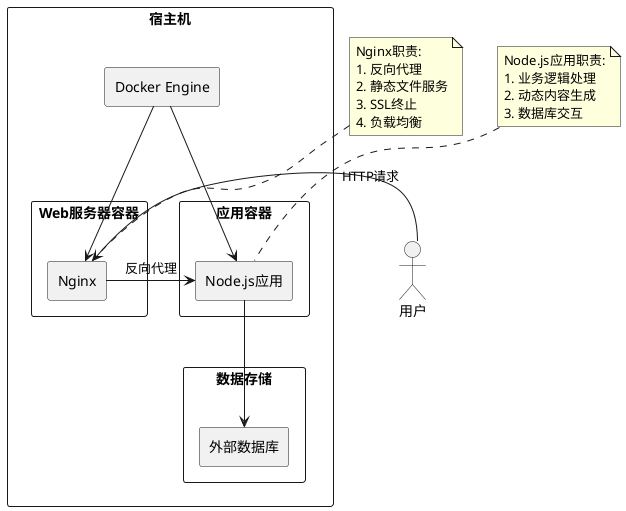
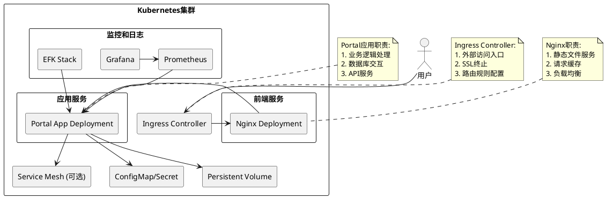

# 部署架构设计文档

## 1. 概述

本文档详细说明了公司门户网站的部署架构设计方案，包括容器化部署策略、环境配置、扩展性考虑以及从Docker单机部署到Kubernetes集群部署的演进路径。

## 2. 部署方案评估

### 2.1 当前项目特点

根据项目需求和技术架构分析，当前项目具有以下特点：
- 基于Node.js和Express.js的Web应用
- 使用EJS模板引擎渲染页面
- 包含静态资源文件
- 需要环境变量配置
- 预期访问量适中
- 需要高可用性和可扩展性

### 2.2 部署选项分析

#### 2.2.1 Docker部署（当前推荐方案）

**适用场景：**
- 中小型Web应用
- 快速部署和测试环境
- 资源有限的部署环境
- 简单的应用架构

**优势：**
- 环境一致性，避免"在我机器上能运行"的问题
- 快速部署和启动
- 资源隔离和优化
- 易于版本管理和回滚
- 简化运维工作

**劣势：**
- 对于复杂微服务架构管理不够灵活
- 缺少自动扩缩容能力
- 负载均衡需要额外配置

#### 2.2.2 Kubernetes部署（未来扩展方案）

**适用场景：**
- 大型复杂应用系统
- 微服务架构
- 高流量网站
- 需要复杂部署策略的场景

**优势：**
- 强大的服务编排能力
- 自动扩缩容
- 服务发现和负载均衡
- 更好的容错和自愈能力
- 多环境管理

**劣势：**
- 学习曲线陡峭
- 初期配置复杂
- 资源开销较大
- 运维成本较高

## 3. Docker部署架构设计

### 3.1 架构图



### 3.2 服务组件说明

#### 3.2.1 Node.js应用容器
- 基于Node.js Alpine镜像构建
- 包含所有必要的应用代码和依赖
- 监听3000端口
- 通过环境变量配置运行参数

#### 3.2.2 Nginx容器
- 使用官方Nginx Alpine镜像
- 作为反向代理服务器
- 提供静态文件服务
- 处理SSL终止
- 实现基础负载均衡

#### 3.2.3 数据存储
- 当前版本使用应用内嵌数据存储
- 生产环境建议使用外部数据库服务

### 3.3 部署配置

#### 3.3.1 Dockerfile
定义了应用容器的构建过程：
- 使用node:18-alpine作为基础镜像
- 复制依赖配置文件并安装生产依赖
- 复制应用源代码
- 暴露3000端口
- 设置默认启动命令

#### 3.3.2 docker-compose.yml
定义了多容器应用的服务编排：
- app服务：运行Node.js应用
- nginx服务：运行Nginx反向代理
- 网络配置：创建隔离的容器网络
- 端口映射：将容器端口映射到主机

#### 3.3.3 Nginx配置
- 反向代理到Node.js应用
- 静态文件缓存优化
- 请求头转发配置

## 4. Kubernetes部署架构设计（演进方案）

### 4.1 架构图



### 4.2 迁移路径

#### 阶段一：容器化部署
当前已完成，使用Docker Compose进行部署。

#### 阶段二：Kubernetes单节点部署
- 将docker-compose.yml转换为Kubernetes部署文件
- 使用minikube或单节点k8s集群进行测试

#### 阶段三：Kubernetes多节点生产部署
- 部署到生产级Kubernetes集群
- 配置Ingress、Service Mesh等高级功能
- 实现自动扩缩容和高可用

## 5. 部署操作指南

### 5.1 Docker部署

1. 克隆项目代码：
```bash
git clone <项目地址>
cd company-portal
```

2. 构建并启动服务：
```bash
docker-compose up -d
```

3. 验证部署：
```bash
# 查看服务状态
docker-compose ps

# 查看日志
docker-compose logs
```

4. 访问应用：
打开浏览器访问 `http://localhost`

### 5.2 环境配置

通过.env文件或docker-compose.yml中的environment部分配置环境变量：
- NODE_ENV: 运行环境（development/production）
- PORT: 应用监听端口

### 5.3 数据持久化

当前版本的静态资源通过volume映射实现持久化：
```yaml
volumes:
  - ./public:/usr/src/app/public
  - ./src:/usr/src/app/src
```

## 6. 监控和日志

### 6.1 应用日志

Docker容器日志可通过以下命令查看：
```bash
# 查看所有服务日志
docker-compose logs

# 查看特定服务日志
docker-compose logs app
```

### 6.2 性能监控

建议集成以下监控方案：
- 应用性能监控（APM）工具
- 基础设施监控（CPU、内存、磁盘）
- HTTP请求监控

## 7. 安全考虑

### 7.1 镜像安全
- 使用官方基础镜像
- 定期更新基础镜像和依赖
- 执行安全扫描

### 7.2 网络安全
- 限制容器间网络访问
- 使用网络安全策略
- 启用HTTPS

### 7.3 数据安全
- 敏感信息通过环境变量或密钥管理
- 数据备份策略
- 访问控制

## 8. 扩展性考虑

### 8.1 水平扩展
- 通过增加应用容器实例实现
- 使用负载均衡分发请求

### 8.2 垂直扩展
- 增加容器资源限制
- 优化应用性能

### 8.3 微服务拆分
随着业务发展，可将应用拆分为多个微服务：
- 用户服务
- 内容服务
- 搜索服务
- 文件服务

## 9. 总结

当前项目采用Docker容器化部署是最合适的选择，具有部署简单、环境一致、易于维护等优势。随着业务发展和访问量增加，可以平滑迁移到Kubernetes部署架构，获得更强大的服务编排和管理能力。