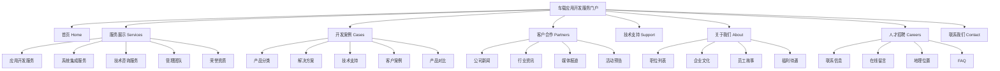
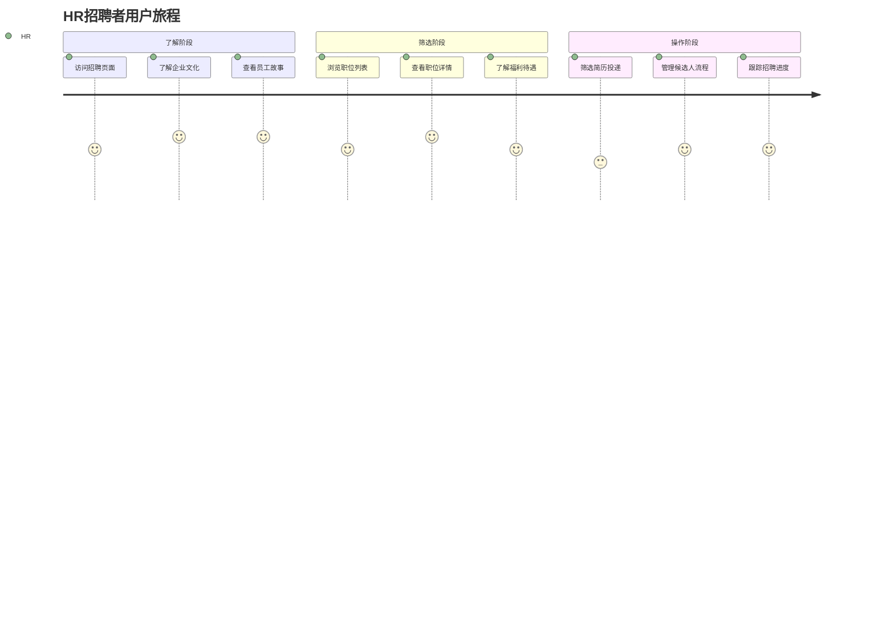
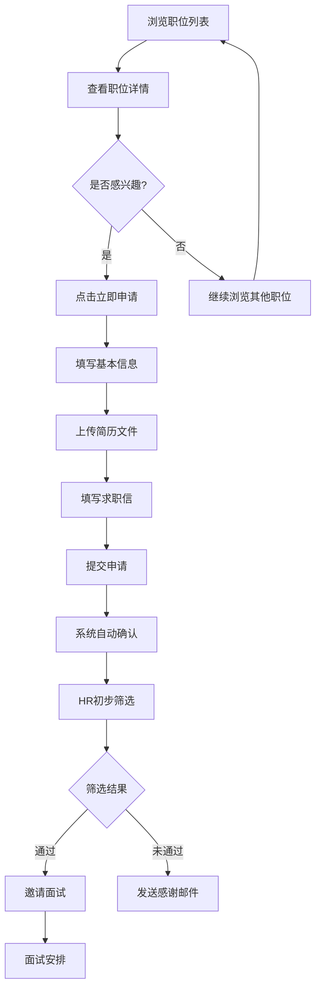
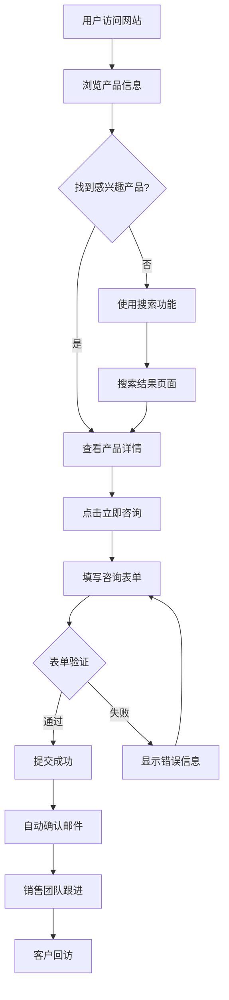
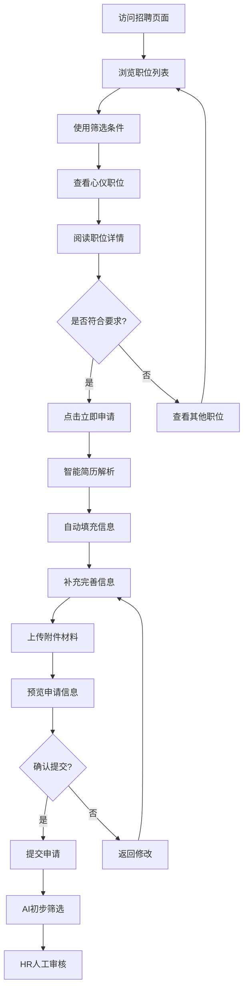
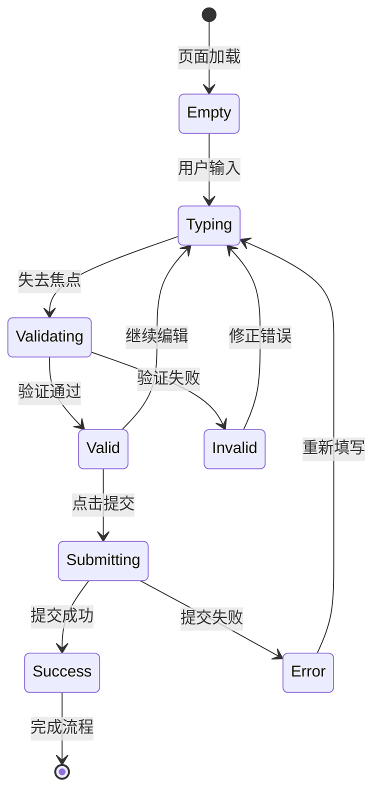
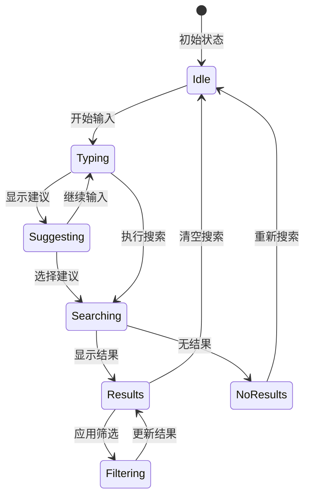
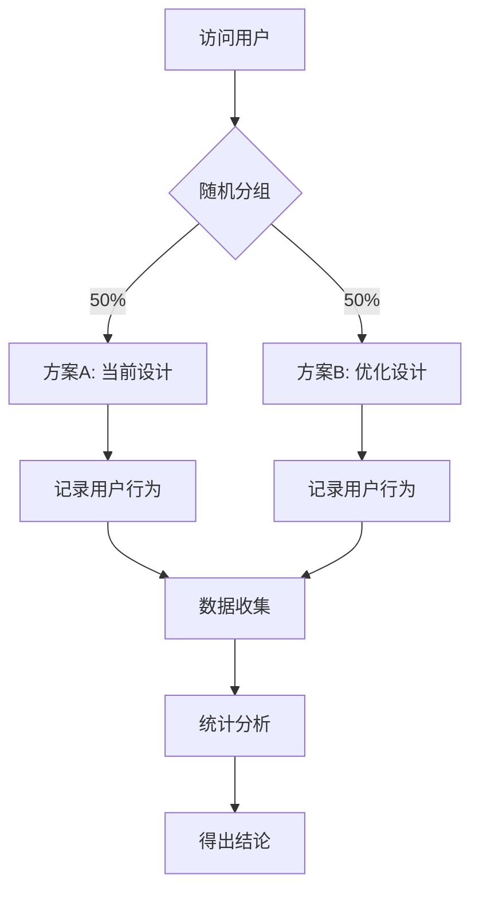
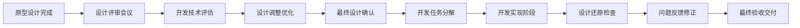

# 车载应用开发服务公司门户网站产品原型设计文档 v2.0

## 1. 文档信息与原型策略

| 项目 | 内容 |
|------|------|
| 文档名称 | 车载应用开发服务公司门户网站产品原型设计文档 |
| 文档版本 | v2.0 |
| 创建日期 | 2025-07-28 |
| 最后更新 | 2025-07-28 |
| 作者 | 产品设计团队 |
| 工具 | Figma, Mermaid, ASCII Art |
| 审核人 | 产品总监、UX总监 |

### 1.1 原型设计策略

#### 1.1.1 原型层次体系
```
原型保真度层次
    ┌─────────────────────┐
    │    高保真原型 80%    │  视觉设计、交互细节
    ├─────────────────────┤
    │    中保真原型 60%    │  交互流程、内容结构
    ├─────────────────────┤
    │    低保真原型 40%    │  信息架构、页面布局
    ├─────────────────────┤
    │    概念原型 20%      │  产品概念、核心功能
    └─────────────────────┘
```

#### 1.1.2 原型目标与验证点
| 原型类型 | 主要目标 | 验证内容 | 目标用户 |
|---------|---------|---------|---------|
| **概念原型** | 验证产品概念 | 核心价值主张、功能优先级 | 利益相关者、决策者 |
| **流程原型** | 验证用户旅程 | 任务流程、信息架构 | UX设计师、产品经理 |
| **交互原型** | 验证交互设计 | 操作逻辑、界面反馈 | 开发团队、测试团队 |
| **视觉原型** | 验证视觉设计 | 品牌表达、视觉层次 | 设计团队、品牌团队 |

## 2. 信息架构与站点地图

### 2.1 整体信息架构



### 2.2 用户导航路径分析

#### 2.2.1 核心用户路径
**企业决策者典型路径**


**HR招聘者典型路径**


## 3. 页面布局原型设计

### 3.1 首页布局原型

#### 3.1.1 首页整体结构
```
┌─────────────────────────────────────────────────────────────┐
│                        顶部导航栏                            │
│  [LOGO]  首页  关于我们  产品服务  新闻  招聘  联系   [搜索] │
└─────────────────────────────────────────────────────────────┘
┌─────────────────────────────────────────────────────────────┐
│                        轮播图区域                            │
│     ┌─────────────────────────────────────────────────┐     │
│     │                                                 │     │
│     │            主要产品/服务展示                     │     │
│     │          [立即了解] [联系我们]                   │     │
│     │                                                 │     │
│     └─────────────────────────────────────────────────┘     │
│                     ● ○ ○ ○ (指示器)                        │
└─────────────────────────────────────────────────────────────┘
┌─────────────────────────────────────────────────────────────┐
│                      核心价值展示                            │
│  ┌──────────┐  ┌──────────┐  ┌──────────┐  ┌──────────┐   │
│  │  [图标]  │  │  [图标]  │  │  [图标]  │  │  [图标]  │   │
│  │   专业   │  │   创新   │  │   可靠   │  │   服务   │   │
│  │  简短描述 │  │  简短描述 │  │  简短描述 │  │  简短描述 │   │
│  └──────────┘  └──────────┘  └──────────┘  └──────────┘   │
└─────────────────────────────────────────────────────────────┘
┌─────────────────────────────────────────────────────────────┐
│                      产品服务展示                            │
│  ┌─────────────┐  ┌─────────────┐  ┌─────────────┐         │
│  │             │  │             │  │             │         │
│  │  产品图片   │  │  产品图片   │  │  产品图片   │         │
│  │             │  │             │  │             │         │
│  │  产品名称   │  │  产品名称   │  │  产品名称   │         │
│  │  简短介绍   │  │  简短介绍   │  │  简短介绍   │         │
│  │ [了解更多]  │  │ [了解更多]  │  │ [了解更多]  │         │
│  └─────────────┘  └─────────────┘  └─────────────┘         │
└─────────────────────────────────────────────────────────────┘
┌─────────────────────────────────────────────────────────────┐
│                      新闻动态                                │
│  ┌─────────────────────────────────────────────────────┐   │
│  │ 最新新闻标题                              2025-01-15 │   │
│  │ 新闻摘要内容...                          [阅读更多] │   │
│  ├─────────────────────────────────────────────────────┤   │
│  │ 第二条新闻标题                            2025-01-10 │   │
│  │ 新闻摘要内容...                          [阅读更多] │   │
│  └─────────────────────────────────────────────────────┘   │
│                                                [更多新闻] │
└─────────────────────────────────────────────────────────────┘
┌─────────────────────────────────────────────────────────────┐
│                      合作伙伴                                │
│  LOGO1   LOGO2   LOGO3   LOGO4   LOGO5   LOGO6   LOGO7    │
└─────────────────────────────────────────────────────────────┘
┌─────────────────────────────────────────────────────────────┐
│                        页脚                                  │
│  ┌──────────┐  ┌──────────┐  ┌──────────┐  ┌──────────┐   │
│  │ 产品服务 │  │ 关于我们 │  │ 客户支持 │  │ 联系方式 │   │
│  │ 产品1    │  │ 公司简介 │  │ 技术支持 │  │ 电话号码 │   │
│  │ 产品2    │  │ 发展历程 │  │ 常见问题 │  │ 邮箱地址 │   │
│  │ 解决方案 │  │ 企业文化 │  │ 下载中心 │  │ 办公地址 │   │
│  └──────────┘  └──────────┘  └──────────┘  └──────────┘   │
│                                                             │
│  版权信息 | 隐私政策 | 法律声明 | 网站地图    [社交媒体图标] │
└─────────────────────────────────────────────────────────────┘
```

#### 3.1.2 首页关键交互点
| 交互元素 | 交互行为 | 预期结果 | 设计考量 |
|---------|---------|---------|---------|
| **轮播图** | 自动播放 + 手动切换 | 展示核心信息，引导用户操作 | 3-5秒自动切换，支持触摸滑动 |
| **CTA按钮** | 悬停效果 + 点击跳转 | 引导用户到关键页面 | 主按钮突出，次按钮辅助 |
| **产品卡片** | 悬停浮起 + 点击详情 | 吸引注意，进入产品页 | 卡片阴影变化，信息层次清晰 |
| **新闻列表** | 悬停高亮 + 点击阅读 | 展示企业动态，建立信任 | 时间信息突出，摘要吸引人 |

### 3.2 产品页面布局原型

#### 3.2.1 产品列表页面
```
┌─────────────────────────────────────────────────────────────┐
│  首页 > 产品服务 > 解决方案                    [搜索产品]    │
└─────────────────────────────────────────────────────────────┘
┌─────────────────────────────────────────────────────────────┐
│                        页面标题                              │
│                      产品与解决方案                          │
│                    为您提供专业的技术解决方案                  │
└─────────────────────────────────────────────────────────────┘
┌─────────────────────────────────────────────────────────────┐
│ 筛选条件                                                    │
│ ┌──────────┐ ┌──────────┐ ┌──────────┐ ┌──────────┐       │
│ │ 产品类别 ▼│ │ 应用行业 ▼│ │ 价格范围 ▼│ │   排序   ▼│       │
│ └──────────┘ └──────────┘ └──────────┘ └──────────┘       │
│                                                [重置筛选]   │
└─────────────────────────────────────────────────────────────┘
┌─────────────────────────────────────────────────────────────┐
│ 产品展示区域                                                │
│ ┌─────────────┐ ┌─────────────┐ ┌─────────────┐           │
│ │  [产品图片] │ │  [产品图片] │ │  [产品图片] │           │
│ │             │ │             │ │             │           │
│ │  产品名称A  │ │  产品名称B  │ │  产品名称C  │           │
│ │  产品简介.. │ │  产品简介.. │ │  产品简介.. │           │
│ │  ⭐⭐⭐⭐⭐  │ │  ⭐⭐⭐⭐⭐  │ │  ⭐⭐⭐⭐⭐  │           │
│ │ [查看详情]  │ │ [查看详情]  │ │ [查看详情]  │           │
│ │ [立即咨询]  │ │ [立即咨询]  │ │ [立即咨询]  │           │
│ └─────────────┘ └─────────────┘ └─────────────┘           │
│                                                             │
│ ┌─────────────┐ ┌─────────────┐ ┌─────────────┐           │
│ │  [产品图片] │ │  [产品图片] │ │  [产品图片] │           │
│ │  产品名称D  │ │  产品名称E  │ │  产品名称F  │           │
│ │  产品简介.. │ │  产品简介.. │ │  产品简介.. │           │
│ │  ⭐⭐⭐⭐⭐  │ │  ⭐⭐⭐⭐⭐  │ │  ⭐⭐⭐⭐⭐  │           │
│ │ [查看详情]  │ │ [查看详情]  │ │ [查看详情]  │           │
│ │ [立即咨询]  │ │ [立即咨询]  │ │ [立即咨询]  │           │
│ └─────────────┘ └─────────────┘ └─────────────┘           │
└─────────────────────────────────────────────────────────────┘
┌─────────────────────────────────────────────────────────────┐
│                      分页导航                                │
│               ← 上一页  1 2 3 4 5  下一页 →                 │
└─────────────────────────────────────────────────────────────┘
```

#### 3.2.2 产品详情页面
```
┌─────────────────────────────────────────────────────────────┐
│  首页 > 产品服务 > 智能制造解决方案                         │
└─────────────────────────────────────────────────────────────┘
┌─────────────────────────────────────────────────────────────┐
│ ┌─────────────────────┐ ┌─────────────────────────────────┐ │
│ │                     │ │      智能制造解决方案           │ │
│ │    产品主图         │ │                                 │ │
│ │                     │ │  核心特性：                     │ │
│ │    [360°查看]       │ │  ✓ 智能化生产管理               │ │
│ │                     │ │  ✓ 实时数据分析                 │ │
│ └─────────────────────┘ │  ✓ 预测性维护                   │ │
│ ┌───┐┌───┐┌───┐┌───┐  │  ✓ 供应链优化                   │ │
│ │图1││图2││图3││图4│  │                                 │ │
│ └───┘└───┘└───┘└───┘  │  应用行业：制造业、电子、汽车   │ │
│                         │                                 │ │
│                         │  [立即咨询] [下载资料] [演示预约] │ │
│                         └─────────────────────────────────┘ │
└─────────────────────────────────────────────────────────────┘
┌─────────────────────────────────────────────────────────────┐
│                        详细信息                              │
│ ┌─────────┐ ┌─────────┐ ┌─────────┐ ┌─────────┐           │
│ │ 产品介绍 │ │ 技术参数 │ │ 客户案例 │ │ 服务支持 │           │
│ └─────────┘ └─────────┘ └─────────┘ └─────────┘           │
│                                                             │
│ [当前选中：产品介绍]                                        │
│                                                             │
│ 产品详细介绍内容...                                         │
│ • 核心功能说明                                              │
│ • 技术优势分析                                              │
│ • 实施方案介绍                                              │
│ • ROI分析报告                                               │
│                                                             │
│ ┌─────────────────────────────────────────────────────┐   │
│ │                   架构图示                           │   │
│ │         [生产层] → [控制层] → [管理层]               │   │
│ └─────────────────────────────────────────────────────┘   │
└─────────────────────────────────────────────────────────────┘
┌─────────────────────────────────────────────────────────────┐
│                      成功案例                                │
│ ┌─────────────────────────────────────────────────────┐   │
│ │ 某大型制造企业数字化转型项目                         │   │
│ │                                                     │   │
│ │ 项目背景：传统制造企业面临效率低下问题               │   │
│ │ 解决方案：部署智能制造解决方案                       │   │ 
│ │ 实施效果：                                           │   │
│ │ • 生产效率提升 40%                                   │   │
│ │ • 质量缺陷降低 60%                                   │   │
│ │ • 运营成本降低 25%                                   │   │
│ │                                          [详细案例] │   │
│ └─────────────────────────────────────────────────────┘   │
└─────────────────────────────────────────────────────────────┘
┌─────────────────────────────────────────────────────────────┐
│                      相关产品推荐                            │
│ ┌─────────────┐ ┌─────────────┐ ┌─────────────┐           │
│ │  产品图片   │ │  产品图片   │ │  产品图片   │           │
│ │  相关产品A  │ │  相关产品B  │ │  相关产品C  │           │
│ │ [了解更多]  │ │ [了解更多]  │ │ [了解更多]  │           │
│ └─────────────┘ └─────────────┘ └─────────────┘           │
└─────────────────────────────────────────────────────────────┘
```

### 3.3 招聘页面布局原型

#### 3.3.1 招聘主页面
```
┌─────────────────────────────────────────────────────────────┐
│  首页 > 人才招聘                                           │
└─────────────────────────────────────────────────────────────┘
┌─────────────────────────────────────────────────────────────┐
│                      招聘主横幅                              │
│     ┌─────────────────────────────────────────────────┐     │
│     │                                                 │     │
│     │              加入我们的团队                      │     │
│     │          与优秀的人一起创造未来                   │     │
│     │              [查看职位] [了解文化]               │     │
│     │                                                 │     │
│     └─────────────────────────────────────────────────┘     │
└─────────────────────────────────────────────────────────────┘
┌─────────────────────────────────────────────────────────────┐
│ 职位筛选                                                    │
│ ┌──────────┐ ┌──────────┐ ┌──────────┐ ┌──────────┐       │
│ │   部门   ▼│ │   地点   ▼│ │ 工作性质 ▼│ │ 经验要求 ▼│       │
│ └──────────┘ └──────────┘ └──────────┘ └──────────┘       │
│                              [搜索职位] [重置筛选]         │
└─────────────────────────────────────────────────────────────┘
┌─────────────────────────────────────────────────────────────┐
│ 热门职位                                                    │
│ ┌─────────────────────────────────────────────────────┐   │
│ │ 高级产品经理                                         │   │
│ │ 技术部 | 北京 | 5-10年经验 | 全职              新 │   │
│ │ 职位描述：负责产品策略制定和产品规划...              │   │
│ │ 要求：本科以上学历，5年以上产品管理经验...           │   │
│ │                                          [立即申请] │   │
│ ├─────────────────────────────────────────────────────┤   │
│ │ 前端开发工程师                                       │   │
│ │ 研发部 | 上海 | 3-5年经验 | 全职               热门 │   │
│ │ 职位描述：负责Web前端开发和用户界面设计...           │   │
│ │ 要求：熟练掌握React、Vue等前端框架...               │   │
│ │                                          [立即申请] │   │
│ ├─────────────────────────────────────────────────────┤   │
│ │ 数据分析师                                           │   │
│ │ 数据部 | 深圳 | 2-3年经验 | 全职                     │   │
│ │ 职位描述：负责业务数据分析和数据挖掘...              │   │
│ │ 要求：统计学、数学相关专业，熟悉Python...           │   │
│ │                                          [立即申请] │   │
│ └─────────────────────────────────────────────────────┘   │
│                                              [查看更多职位] │
└─────────────────────────────────────────────────────────────┘
┌─────────────────────────────────────────────────────────────┐
│                      企业文化展示                            │
│ ┌─────────────┐ ┌─────────────┐ ┌─────────────┐           │
│ │  [员工照片] │ │  [团建活动] │ │  [办公环境] │           │
│ │     开放     │ │     协作     │ │     创新     │           │
│ │  工作氛围开放│ │ 团队协作紧密 │ │ 鼓励创新思维 │           │
│ │  沟通无障碍  │ │ 跨部门合作   │ │ 技术驱动发展 │           │
│ └─────────────┘ └─────────────┘ └─────────────┘           │
└─────────────────────────────────────────────────────────────┘
┌─────────────────────────────────────────────────────────────┐
│                      员工福利                                │
│ ┌──────────┐ ┌──────────┐ ┌──────────┐ ┌──────────┐       │
│ │ 薪资福利 │ │ 成长发展 │ │ 工作环境 │ │ 生活关怀 │       │
│ │ 竞争薪资 │ │ 培训体系 │ │ 舒适办公 │ │ 弹性工作 │       │
│ │ 绩效奖金 │ │ 晋升通道 │ │ 先进设备 │ │ 健康体检 │       │
│ │ 股票期权 │ │ 技能认证 │ │ 休闲区域 │ │ 团建活动 │       │
│ └──────────┘ └──────────┘ └──────────┘ └──────────┘       │
└─────────────────────────────────────────────────────────────┘
```

#### 3.3.2 职位申请流程原型


## 4. 用户流程原型

### 4.1 核心业务流程

#### 4.1.1 客户咨询流程


#### 4.1.2 简历投递流程


### 4.2 交互状态流程

#### 4.2.1 表单交互状态


#### 4.2.2 搜索交互状态


## 5. 交互原型规范

### 5.1 微交互设计规范

#### 5.1.1 按钮交互状态
```
按钮状态变化：
默认状态 → 悬停状态 → 激活状态 → 完成状态

┌─────────────┐    ┌─────────────┐    ┌─────────────┐    ┌─────────────┐
│   立即咨询   │ →  │   立即咨询   │ →  │   提交中...  │ →  │   提交成功   │
│  (默认样式)  │    │  (悬停效果)  │    │  (加载动画)  │    │  (成功反馈)  │
└─────────────┘    └─────────────┘    └─────────────┘    └─────────────┘
     蓝色背景         阴影+位移         禁用+spinner       绿色+对勾
     白色文字         深蓝背景         灰色背景           白色文字
```

#### 5.1.2 表单验证反馈
```
输入框状态变化：
┌─────────────────┐    ┌─────────────────┐    ┌─────────────────┐
│ 请输入邮箱地址   │ →  │ user@domain     │ →  │ user@domain.com │
│ (占位符提示)     │    │ (输入过程)       │    │ (验证通过)       │
│ 边框：灰色       │    │ 边框：蓝色       │    │ 边框：绿色       │
└─────────────────┘    └─────────────────┘    └─────────────────┘
                                               ✓ 邮箱格式正确

                       ┌─────────────────┐
                    ×  │ user@           │
                       │ (格式错误)       │
                       │ 边框：红色       │
                       └─────────────────┘
                       ⚠️ 请输入有效邮箱
```

### 5.2 页面转场动效

#### 5.2.1 页面切换动画
```
页面转场类型：

1. 淡入淡出 (Fade)
   页面A (opacity: 1) → 页面A (opacity: 0) → 页面B (opacity: 0) → 页面B (opacity: 1)
   
2. 滑动切换 (Slide)
   页面A → 页面A(transform: translateX(-100%)) + 页面B(transform: translateX(0))
   
3. 缩放进入 (Scale)
   页面B (transform: scale(0.8), opacity: 0) → 页面B (transform: scale(1), opacity: 1)
```

#### 5.2.2 内容加载动画
```
加载状态展示：

1. 骨架屏 (Skeleton)
   ┌─────────────────┐
   │ ████████        │ (标题占位)
   │ ██████          │ (副标题占位)
   │ ████████████    │ (内容占位)
   │ ██████████      │ (内容占位)
   └─────────────────┘
   
2. 加载指示器 (Spinner)
   ◐ 加载中... (旋转动画)
   
3. 进度条 (Progress)
   ▓▓▓▓▓▓▓░░░ 70% (显示加载进度)
```

## 6. 响应式原型适配

### 6.1 断点适配策略

#### 6.1.1 多设备布局对比
```
桌面端 (1200px+)                平板端 (768px-1199px)           手机端 (<768px)
┌─────────────────────┐         ┌─────────────────┐             ┌─────────────┐
│ [Logo] Nav Nav Nav  │         │ [Logo]    [≡]  │             │ [Logo] [≡]  │
├─────────────────────┤         ├─────────────────┤             ├─────────────┤
│                     │         │                 │             │             │
│   三列产品展示       │         │   两列产品展示   │             │ 单列产品展示 │
│  [1] [2] [3]        │         │    [1] [2]      │             │    [1]      │
│  [4] [5] [6]        │         │    [3] [4]      │             │    [2]      │
│                     │         │                 │             │    [3]      │
└─────────────────────┘         └─────────────────┘             └─────────────┘

导航：水平展开                    导航：部分隐藏                 导航：汉堡菜单
内容：多列布局                    内容：适中布局                 内容：单列堆叠
交互：鼠标悬停                    交互：触摸优化                 交互：手指友好
```

#### 6.1.2 组件响应式行为
| 组件类型 | 桌面端行为 | 平板端行为 | 手机端行为 |
|---------|-----------|-----------|-----------|
| **导航栏** | 水平展开所有菜单项 | 部分收纳到更多菜单 | 汉堡菜单全部收纳 |
| **产品卡片** | 3-4列网格布局 | 2列网格布局 | 单列垂直堆叠 |
| **表单** | 多列表单布局 | 两列简化布局 | 单列垂直排列 |
| **图片画廊** | 悬停查看大图 | 点击查看大图 | 滑动查看大图 |
| **数据表格** | 完整表格显示 | 隐藏次要列 | 卡片式展示 |

### 6.2 触摸交互优化

#### 6.2.1 移动端手势支持
```
手势交互映射：

1. 轮播图控制
   ← 滑动 ← | [图片] | → 滑动 →
   (向左切换)        (向右切换)

2. 产品图片查看
   ↑ 向上滑动 = 关闭大图
   ← → 左右滑动 = 切换图片
   ⚬ 双击 = 放大图片
   ⊕ 两指捏合 = 缩放图片

3. 列表刷新
   ↓ 下拉 = 刷新内容
   ↑ 上拉 = 加载更多

4. 导航控制
   → 右滑 = 打开侧边菜单
   ← 左滑 = 关闭侧边菜单
```

#### 6.2.2 触摸目标优化
```
最小触摸区域规范：

按钮尺寸：
┌─────────────┐  ← 最小 44×44px
│   点击按钮   │
│  (推荐大小)  │
└─────────────┘

链接间距：
文字链接A     ← 最小间距 8px
文字链接B     
文字链接C

触摸反馈：
点击前: [按钮]
点击时: [按钮] (背景变色/阴影)
点击后: [按钮] (恢复原状)
```

## 7. 可用性测试原型

### 7.1 测试任务设计

#### 7.1.1 核心任务列表
| 任务ID | 任务描述 | 预期时间 | 成功标准 | 测试重点 |
|--------|---------|---------|---------|---------|
| **T01** | 在网站上找到智能制造解决方案并了解详情 | 2分钟 | 成功进入产品详情页 | 信息架构、导航设计 |
| **T02** | 为前端开发职位提交简历申请 | 5分钟 | 成功提交申请表单 | 表单设计、流程体验 |
| **T03** | 查找公司最新发布的新闻资讯 | 1分钟 | 找到并阅读最新新闻 | 内容发现、信息层次 |
| **T04** | 通过联系表单咨询产品相关问题 | 3分钟 | 成功提交咨询信息 | 表单可用性、反馈机制 |
| **T05** | 在移动设备上浏览公司介绍信息 | 2分钟 | 完整浏览关于我们页面 | 响应式设计、移动体验 |

#### 7.1.2 测试场景脚本
```
测试场景 T01：产品信息查找
━━━━━━━━━━━━━━━━━━━━━━━━━━━━━━━━━━━━━━━━━━━━━━━━━━━━━━━━

背景设定：
您是一家中型制造企业的技术负责人，正在寻找智能制造解决方案
来提升公司的生产效率和管理水平。

任务目标：
请在这个网站上找到智能制造相关的解决方案，并了解其详细信息，
包括功能特性、应用案例和技术参数。

评估要点：
□ 能否在首页快速找到产品入口
□ 产品分类是否清晰易懂  
□ 产品详情信息是否满足需求
□ 整个查找过程是否顺畅自然

观察重点：
- 用户的浏览路径和点击行为
- 在哪些地方出现犹豫或困惑
- 对信息架构和内容组织的反馈
```

### 7.2 原型验证方法

#### 7.2.1 A/B测试方案


**测试变量示例**：
| 测试项目 | 方案A | 方案B | 测试指标 |
|---------|-------|-------|---------|
| **首页CTA按钮** | "了解更多" | "立即咨询" | 点击转化率 |
| **产品卡片布局** | 3列网格 | 2列网格 | 浏览深度 |
| **导航菜单结构** | 扁平结构 | 层级结构 | 查找成功率 |
| **表单字段数量** | 8个字段 | 5个字段 | 完成率 |

#### 7.2.2 热力图分析计划
```
页面热力图分析重点：

1. 首页注意力分布
   ┌─────────────────────┐
   │ [LOGO]  Nav  Nav   │ ← 导航区关注度
   ├─────────────────────┤
   │      🔥🔥🔥🔥        │ ← 轮播图热点区域
   │     Banner区域      │
   ├─────────────────────┤
   │ 🔥    🔥    🔥      │ ← 产品卡片点击热点
   │ [产品A][产品B][产品C] │
   └─────────────────────┘

2. 表单交互分析
   - 哪些字段停留时间最长
   - 哪些字段导致用户放弃
   - 提交按钮的注意力程度
   - 错误信息的可见性

3. 产品详情页滚动行为
   - 用户滚动到哪个深度
   - 哪些内容获得最多关注
   - 侧边栏功能的使用情况
```

## 8. 原型交付规范

### 8.1 设计文件组织

#### 8.1.1 Figma文件结构
```
📁 公司门户网站原型设计
├── 📄 封面页 (Cover)
├── 📁 01_信息架构 (Information Architecture)
│   ├── 🗺️ 站点地图 (Sitemap)
│   ├── 🔀 用户流程图 (User Flows)
│   └── 📊 内容策略 (Content Strategy)
├── 📁 02_低保真原型 (Low-fidelity Wireframes)
│   ├── 🏠 首页框架
│   ├── 📦 产品页框架
│   ├── 👥 招聘页框架
│   └── 📞 联系页框架
├── 📁 03_中保真原型 (Mid-fidelity Prototype)
│   ├── 🖥️ 桌面端原型
│   ├── 📱 移动端原型
│   └── 🔗 交互连接
├── 📁 04_高保真原型 (High-fidelity Prototype)
│   ├── 🎨 视觉设计版本
│   ├── 🎬 动效演示
│   └── 📋 设计规范
└── 📁 05_组件库 (Component Library)
    ├── 🧩 基础组件
    ├── 🎛️ 表单组件
    └── 📐 布局组件
```

#### 8.1.2 原型标注规范
```
设计标注要求：

1. 尺寸标注
   ┌─────────────┐ ← 容器宽度: 1200px
   │             │
   │   内容区域   │ ← 内边距: 24px
   │             │
   └─────────────┘
   ↑               ↑
   左边距: 40px    右边距: 40px

2. 颜色标注
   🎨 主色: #2C5282
   🎨 辅色: #319795
   🎨 文字: #2D3748
   🎨 背景: #F7FAFC

3. 字体标注
   📝 标题: 24px/1.3 PingFang SC Medium
   📝 正文: 16px/1.5 PingFang SC Regular
   📝 说明: 14px/1.4 PingFang SC Regular

4. 交互标注
   🖱️ 悬停: 背景色变为 #1A365D
   👆 点击: 跳转至产品详情页
   ⌨️ 快捷键: Tab键可聚焦
```

### 8.2 开发交付清单

#### 8.2.1 原型交付物
```
交付清单检查：

设计文件 ✓
□ Figma设计文件 (.fig)
□ 导出的图片资源 (.png, .jpg, .svg)
□ 图标库文件 (.svg)
□ 字体文件 (.ttf, .woff2)

文档说明 ✓
□ 原型设计说明文档 (.md)
□ 交互行为说明书 (.pdf)
□ 响应式适配指南 (.md)
□ 可访问性检查清单 (.xlsx)

技术规范 ✓
□ CSS样式指南 (.scss)
□ 组件实现规范 (.md)
□ 动效参数说明 (.json)
□ 性能优化建议 (.md)

测试相关 ✓
□ 可用性测试报告 (.pdf)
□ A/B测试方案 (.md)
□ 测试用例清单 (.xlsx)
□ 问题修复记录 (.md)
```

#### 8.2.2 开发协作流程


---

**原型设计确认**
- 产品设计负责人：_______________  日期：___________
- 用户体验负责人：_______________  日期：___________
- 前端开发负责人：_______________  日期：___________

**原型维护说明**
本原型文档将随着产品迭代和用户反馈进行持续更新，确保设计方案的有效性和可行性。所有重大设计变更都将通过正式评审流程确认。 