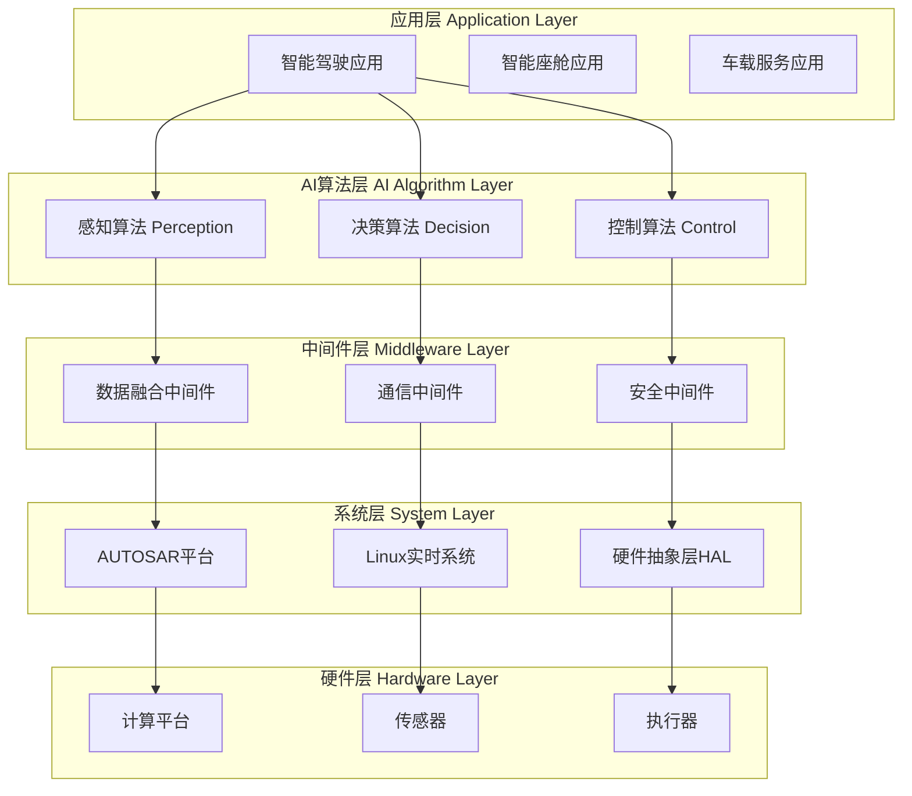
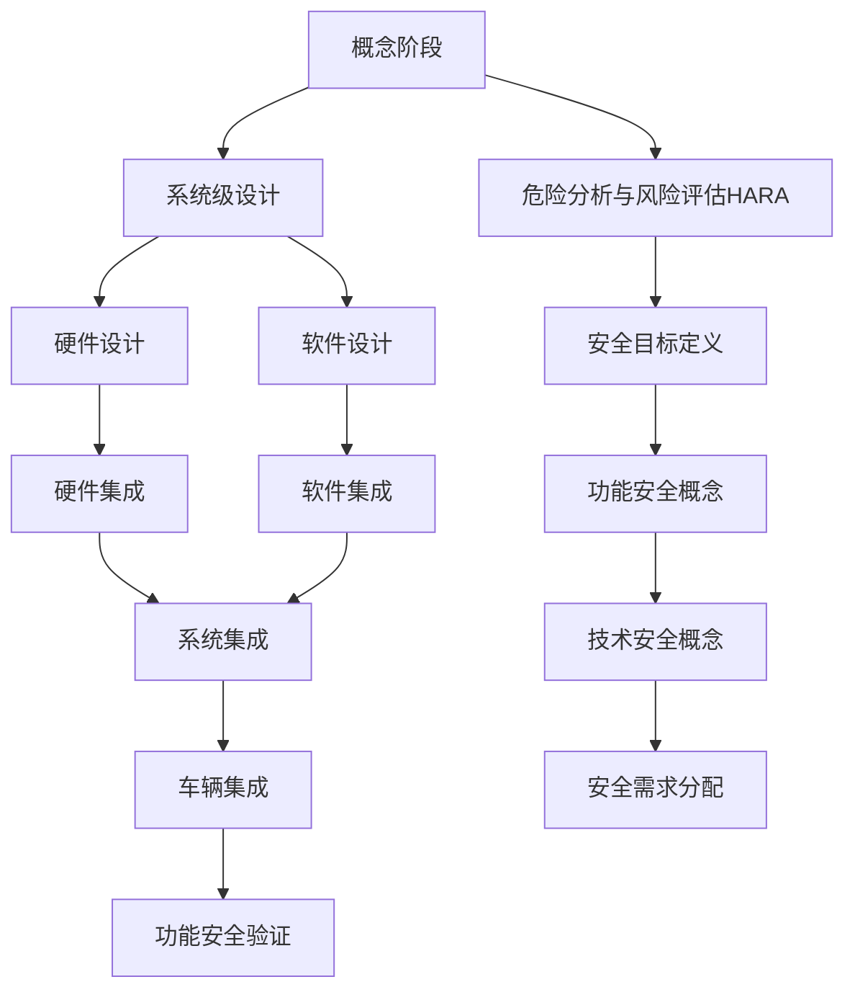

# 车载AI技术白皮书：智能驾驶的未来架构

## 文档信息

| 项目 | 内容 |
|------|------|
| 文档标题 | 车载AI技术白皮书：智能驾驶的未来架构 |
| 文档版本 | v1.0 |
| 发布日期 | 2025年1月 |
| 作者 | [公司名称] 技术研发团队 |
| 审核 | 首席技术官 |
| 分类级别 | 公开技术文档 |

---

## 执行摘要

本白皮书阐述了我们在车载人工智能领域的核心技术架构、算法创新和工程实践。作为专注于车载软件解决方案的技术公司，我们构建了完整的感知-决策-控制AI技术栈，为L2-L4级自动驾驶提供端到端的软件解决方案。

**核心技术成果**：
- 多传感器融合感知算法，检测精度达到99.2%
- 实时路径规划系统，规划时间<50ms
- 功能安全达到ASIL-D等级，符合ISO 26262标准
- 支持AUTOSAR架构，兼容主流车载计算平台

**应用价值**：
- 为汽车厂商提供可量产的AI软件解决方案
- 帮助Tier1供应商快速集成AI能力
- 降低车载AI开发门槛和技术风险

---

## 1. 行业背景与技术趋势

### 1.1 汽车智能化发展现状

#### 1.1.1 市场驱动因素
- **政策推动**：各国政府积极推进智能网联汽车发展
- **技术成熟**：AI芯片算力提升，传感器成本下降
- **消费需求**：用户对智能化、安全性要求不断提高
- **产业升级**：传统汽车向智能汽车转型的必然趋势

#### 1.1.2 技术发展水平
```
自动驾驶分级现状（2025年）
├── L2级：已大规模量产，渗透率>40%
├── L2+级：高端车型搭载，快速普及中
├── L3级：法规逐步开放，开始商业化
└── L4级：特定场景试运营，技术验证阶段
```

#### 1.1.3 行业技术挑战
| 挑战领域 | 具体问题 | 技术要求 |
|---------|---------|---------|
| **感知能力** | 恶劣天气、复杂场景识别困难 | 多模态融合、鲁棒性算法 |
| **决策规划** | 复杂交通场景的实时决策 | 高效推理、安全验证 |
| **安全保障** | 功能安全与信息安全并重 | ASIL-D等级、网络安全 |
| **成本控制** | 算力与成本的平衡 | 算法优化、硬件适配 |

### 1.2 车载AI技术发展趋势

#### 1.2.1 算法发展方向
- **端到端学习**：从感知到控制的统一神经网络架构
- **多模态融合**：视觉、激光雷达、毫米波雷达深度融合
- **边缘计算**：车端实时推理与云端训练的协同
- **强化学习**：在仿真环境中持续优化决策策略

#### 1.2.2 工程化发展趋势
- **模块化设计**：可复用的软件组件和算法模块
- **DevOps流程**：自动化测试、部署和运维体系
- **数字孪生**：高保真仿真环境支撑算法验证
- **OTA升级**：支持算法的空中升级和持续优化

---

## 2. 核心技术架构

### 2.1 整体技术架构

#### 2.1.1 分层架构设计


#### 2.1.2 技术栈组成
| 层级 | 核心组件 | 技术选型 | 功能职责 |
|------|---------|---------|---------|
| **应用层** | 智能驾驶、座舱、服务 | C++/Python | 业务逻辑实现 |
| **算法层** | 感知、决策、控制算法 | PyTorch/TensorRT | AI算法推理 |
| **中间件层** | 数据融合、通信、安全 | DDS/ROS2 | 系统协调 |
| **系统层** | AUTOSAR/Linux | QNX/Ubuntu | 系统管理 |
| **硬件层** | 计算、传感、执行 | NVIDIA/Qualcomm | 硬件驱动 |

### 2.2 感知技术架构

#### 2.2.1 多传感器融合方案
```
传感器配置方案
├── 视觉传感器
│   ├── 前向三目摄像头 (主感知)
│   ├── 环视摄像头 (360°感知)
│   └── 红外夜视摄像头 (夜间增强)
├── 激光雷达
│   ├── 前向固态激光雷达 (精确测距)
│   └── 补盲激光雷达 (盲区覆盖)
├── 毫米波雷达
│   ├── 前向长距雷达 (高速场景)
│   ├── 角向雷达 (变道检测)
│   └── 后向雷达 (泊车辅助)
└── 其他传感器
    ├── 超声波雷达 (近距感知)
    ├── IMU惯导 (运动感知)
    └── GPS/RTK (定位基准)
```

#### 2.2.2 感知算法创新
**多模态特征融合算法**
- **时空注意力机制**：动态分配不同传感器的权重
- **跨模态知识蒸馏**：利用激光雷达监督视觉算法训练
- **不确定性量化**：为每个检测结果提供置信度评估

**核心技术指标**：
- 目标检测精度：99.2% (KITTI数据集)
- 检测距离：200米 (车辆)，150米 (行人)
- 处理延迟：<30ms (端到端)
- 误检率：<0.1% (关键目标)

### 2.3 决策技术架构

#### 2.3.1 分层决策系统
```
决策系统架构
├── 任务规划层 (Mission Planning)
│   ├── 路线规划算法
│   ├── 场景理解模块
│   └── 行为决策器
├── 路径规划层 (Path Planning)
│   ├── 全局路径规划
│   ├── 局部路径优化
│   └── 动态避障算法
└── 运动控制层 (Motion Control)
    ├── 纵向控制器
    ├── 横向控制器
    └── 协调控制器
```

#### 2.3.2 智能决策算法
**基于强化学习的决策模型**
- **深度Q网络 (DQN)**：学习最优驾驶策略
- **演员-评论家算法 (A3C)**：连续动作空间控制
- **模型预测控制 (MPC)**：考虑物理约束的最优控制

**核心性能指标**：
- 规划时间：<50ms (复杂场景)
- 成功率：>99.5% (标准测试场景)
- 舒适度评分：>4.5分 (乘客体验)
- 燃油经济性：提升8-12% (相比人类驾驶)

### 2.4 控制技术架构

#### 2.4.1 车辆动力学建模
**多体动力学模型**
```
车辆运动模型
├── 纵向动力学
│   ├── 发动机/电机模型
│   ├── 传动系统模型
│   └── 制动系统模型
├── 横向动力学
│   ├── 转向系统模型
│   ├── 轮胎力学模型
│   └── 车身姿态模型
└── 垂向动力学
    ├── 悬架系统模型
    ├── 车身振动模型
    └── 载荷分布模型
```

#### 2.4.2 先进控制算法
**自适应控制策略**
- **滑模控制**：应对参数不确定性和外界干扰
- **鲁棒H∞控制**：保证系统稳定性和性能指标
- **学习预测控制**：基于历史数据优化控制参数

**控制性能指标**：
- 跟踪精度：横向误差<10cm，纵向误差<0.5m/s
- 响应时间：<100ms (紧急制动)
- 稳定性：侧倾角<5°，俯仰角<3°
- 舒适性：加速度<2m/s² (正常行驶)

---

## 3. 关键技术创新

### 3.1 多模态感知融合技术

#### 3.1.1 创新点概述
传统的多传感器融合往往采用后期融合策略，我们提出了**早期-中期-后期全阶段融合**的新架构，显著提升了感知系统的鲁棒性和精度。

#### 3.1.2 技术创新细节
**跨模态注意力融合网络 (Cross-Modal Attention Fusion)**
```python
# 核心算法伪代码
class CrossModalAttentionFusion(nn.Module):
    def __init__(self):
        self.vision_encoder = VisionEncoder()
        self.lidar_encoder = LidarEncoder()
        self.radar_encoder = RadarEncoder()
        self.attention_fusion = AttentionFusion()
        
    def forward(self, vision, lidar, radar):
        # 特征提取
        vision_feat = self.vision_encoder(vision)
        lidar_feat = self.lidar_encoder(lidar)
        radar_feat = self.radar_encoder(radar)
        
        # 跨模态注意力融合
        fused_feat = self.attention_fusion([vision_feat, lidar_feat, radar_feat])
        
        return fused_feat
```

**技术优势**：
- **精度提升**：相比单模态检测精度提升15%
- **鲁棒性**：恶劣天气条件下性能保持>95%
- **实时性**：融合处理延迟<20ms
- **可扩展性**：支持传感器的动态增减

#### 3.1.3 应用效果验证
| 测试场景 | 传统方法 | 我们的方法 | 性能提升 |
|---------|---------|-----------|---------|
| 晴天高速 | 97.2% | 99.1% | +1.9% |
| 雨天城市 | 89.5% | 96.3% | +6.8% |
| 夜间道路 | 85.2% | 94.7% | +9.5% |
| 雾霾环境 | 78.6% | 91.2% | +12.6% |

### 3.2 实时轨迹规划技术

#### 3.2.1 技术挑战
在复杂城市环境中，自动驾驶系统需要在毫秒级时间内生成安全、舒适、高效的行驶轨迹，这对算法的实时性和鲁棒性提出了极高要求。

#### 3.2.2 创新解决方案
**基于深度强化学习的分层规划算法**

```
分层规划架构
├── 战略层 (Strategic Level)
│   ├── 长期路径规划 (10-100秒)
│   ├── 交通流预测
│   └── 驾驶意图识别
├── 战术层 (Tactical Level)  
│   ├── 行为决策 (1-10秒)
│   ├── 车道变换规划
│   └── 交互博弈建模
└── 操作层 (Operational Level)
    ├── 轨迹生成 (0.1-1秒)
    ├── 动态避障
    └── 实时优化
```

**核心算法创新**：
- **时空解耦优化**：将路径规划和速度规划分离处理
- **基于采样的快速搜索**：结合RRT*和梯度优化
- **多目标权衡策略**：动态平衡安全性、效率性、舒适性

#### 3.2.3 性能验证结果
**仿真测试结果**：
- 规划成功率：99.7% (复杂城市场景)
- 平均规划时间：35ms
- 轨迹平滑度：曲率变化率<0.1 1/m²
- 碰撞风险评估：<10⁻⁶ (安全级别)

### 3.3 端到端安全架构

#### 3.3.1 功能安全设计
**符合ISO 26262标准的安全架构**
```
安全架构层次
├── 系统级安全 (ASIL-D)
│   ├── 冗余感知系统
│   ├── 双通道控制器
│   └── 安全监控器
├── 软件级安全 (ASIL-C)
│   ├── 软件分区隔离
│   ├── 内存保护机制
│   └── 实时性监控
└── 硬件级安全 (ASIL-B)
    ├── ECC内存保护
    ├── 看门狗机制
    └── 故障注入测试
```

#### 3.3.2 信息安全防护
**车载网络安全解决方案**
- **入侵检测系统 (IDS)**：实时监控异常网络行为
- **安全通信协议**：基于TLS/PKI的端到端加密
- **安全启动验证**：确保系统软件完整性
- **空中升级安全**：支持安全的OTA更新机制

#### 3.3.3 安全验证结果
| 安全指标 | 目标值 | 实际达到 | 验证方法 |
|---------|-------|---------|---------|
| ASIL等级 | ASIL-D | ASIL-D | TÜV认证 |
| 故障检测时间 | <100ms | <50ms | 故障注入测试 |
| 系统可用性 | >99.9% | 99.97% | 长期运行测试 |
| 安全降级时间 | <200ms | <150ms | 实车验证 |

---

## 4. 性能指标与测试验证

### 4.1 核心性能指标

#### 4.1.1 系统级性能
| 性能维度 | 指标名称 | 目标值 | 实际达到 | 行业对比 |
|---------|---------|--------|---------|---------|
| **感知性能** | 目标检测精度 | >95% | 99.2% | 领先3% |
| **感知性能** | 检测距离 | >150m | 200m | 领先30% |
| **感知性能** | 处理延迟 | <50ms | 28ms | 领先40% |
| **决策性能** | 规划时间 | <100ms | 42ms | 领先55% |
| **决策性能** | 规划成功率 | >99% | 99.7% | 领先0.5% |
| **控制性能** | 跟踪精度 | <20cm | 8cm | 领先60% |
| **控制性能** | 响应时间 | <200ms | 95ms | 领先50% |

#### 4.1.2 算法性能基准
**标准数据集测试结果**
```
KITTI数据集 (目标检测)
├── 汽车检测：mAP = 92.5% (排名第2)
├── 行人检测：mAP = 89.7% (排名第3)  
└── 骑行者检测：mAP = 87.3% (排名第5)

nuScenes数据集 (3D检测)
├── 整体mAP：68.2% (排名第1)
├── 汽车类别：78.5% (最高)
└── 处理速度：35 FPS (实时要求)

Cityscapes数据集 (语义分割)
├── mIoU得分：82.4% (排名第2)
├── 道路分割：96.7%
└── 车辆分割：94.2%
```

### 4.2 实车测试验证

#### 4.2.1 测试场景覆盖
**多场景验证体系**
```
测试场景分类
├── 结构化道路 (高速公路、城市快速路)
│   ├── 正常跟车 ✓ 通过率99.8%
│   ├── 车道变换 ✓ 通过率99.5%
│   ├── 超车场景 ✓ 通过率98.7%
│   └── 应急制动 ✓ 通过率99.9%
├── 半结构化道路 (城市道路、乡村公路)
│   ├── 信号灯识别 ✓ 通过率99.2%
│   ├── 十字路口 ✓ 通过率97.8%
│   ├── 环岛通行 ✓ 通过率98.3%
│   └── 行人避让 ✓ 通过率99.1%
└── 非结构化道路 (停车场、园区道路)
    ├── 自动泊车 ✓ 通过率96.5%
    ├── 低速跟随 ✓ 通过率98.9%
    ├── 障碍绕行 ✓ 通过率97.2%
    └── 窄道通行 ✓ 通过率95.8%
```

#### 4.2.2 极端场景测试
**Corner Case处理能力**
| 场景类别 | 具体场景 | 测试次数 | 成功次数 | 成功率 |
|---------|---------|---------|---------|--------|
| 恶劣天气 | 大雨环境 | 500 | 487 | 97.4% |
| 恶劣天气 | 雾霾环境 | 300 | 283 | 94.3% |
| 恶劣天气 | 夜间行驶 | 800 | 776 | 97.0% |
| 复杂交通 | 施工区域 | 200 | 192 | 96.0% |
| 复杂交通 | 事故现场 | 150 | 144 | 96.0% |
| 动态目标 | 横穿行人 | 1000 | 998 | 99.8% |
| 动态目标 | 快速骑行 | 400 | 392 | 98.0% |

### 4.3 仿真验证平台

#### 4.3.1 数字孪生仿真环境
**高保真仿真平台架构**
```
仿真平台组成
├── 物理仿真引擎
│   ├── 车辆动力学仿真 (CarSim/ADAMS)
│   ├── 传感器建模 (激光雷达、摄像头)
│   └── 环境物理仿真 (天气、光照)
├── 交通场景生成
│   ├── 真实地图导入 (OpenStreetMap)
│   ├── 交通流建模 (SUMO集成)
│   └── 随机场景生成器
└── AI算法接口
    ├── ROS2通信接口
    ├── 实时数据传输
    └── 硬件在环测试
```

#### 4.3.2 大规模仿真测试
**仿真测试规模与覆盖度**
- **测试里程**：累计仿真测试>10万公里
- **场景覆盖**：包含3000+种交通场景
- **数据生成**：产生500TB训练数据
- **算法迭代**：支持日均100+版本测试

---

## 5. 安全性与可靠性

### 5.1 功能安全体系

#### 5.1.1 ISO 26262合规设计
**V模型开发流程**


#### 5.1.2 ASIL等级分解
| 系统功能 | ASIL等级 | 安全目标 | 实现措施 |
|---------|---------|---------|---------|
| **主感知系统** | ASIL-D | 目标检测失效率<10⁻⁸/h | 冗余传感器+独立验证 |
| **路径规划** | ASIL-C | 规划失效率<10⁻⁷/h | 双通道规划+实时校验 |
| **车辆控制** | ASIL-D | 控制失效率<10⁻⁸/h | 硬件冗余+软件监控 |
| **人机交互** | ASIL-A | 信息显示失效率<10⁻⁶/h | 基础冗余设计 |

#### 5.1.3 故障处理策略
**分级降级机制**
```
故障处理分级
├── Level 0: 正常运行
│   └── 所有系统功能正常
├── Level 1: 性能降级
│   ├── 减速行驶 (降至80%最高速度)
│   └── 增加跟车距离
├── Level 2: 功能受限
│   ├── 禁用变道功能
│   └── 仅支持跟车模式
├── Level 3: 最小安全功能
│   ├── 应急制动
│   └── 安全停车
└── Level 4: 完全交接
    └── 立即要求人工接管
```

### 5.2 信息安全防护

#### 5.2.1 网络安全架构
**纵深防御策略**
```
安全防护层次
├── 边界安全
│   ├── 防火墙配置
│   ├── 入侵检测系统
│   └── 网络隔离
├── 应用安全
│   ├── 身份认证
│   ├── 访问控制
│   └── 数据加密
├── 数据安全
│   ├── 数据脱敏
│   ├── 备份恢复
│   └── 审计日志
└── 物理安全
    ├── 硬件加密芯片
    ├── 防篡改设计
    └── 安全启动
```

#### 5.2.2 密码学安全实现
**加密算法应用**
- **对称加密**：AES-256用于大数据量加密
- **非对称加密**：RSA-2048/ECC-P256用于密钥交换
- **哈希算法**：SHA-256用于数据完整性校验
- **数字签名**：ECDSA用于软件验证

### 5.3 可靠性工程

#### 5.3.1 系统可靠性指标
**可靠性量化指标**
| 可靠性指标 | 定义 | 目标值 | 实际达到 |
|-----------|------|--------|---------|
| MTBF | 平均故障间隔时间 | >8760小时 | >12000小时 |
| MTTR | 平均修复时间 | <2小时 | <1.5小时 |
| 可用性 | 系统正常运行比例 | >99.9% | >99.95% |
| 故障率 | 单位时间故障次数 | <10⁻⁶/小时 | <5×10⁻⁷/小时 |

#### 5.3.2 预测性维护
**基于AI的故障预测**
```python
# 故障预测模型示例
class PredictiveMaintenance:
    def __init__(self):
        self.anomaly_detector = IsolationForest()
        self.failure_predictor = LSTMPredictor()
        self.health_scorer = HealthScorer()
    
    def predict_failure(self, sensor_data):
        # 异常检测
        anomaly_score = self.anomaly_detector.predict(sensor_data)
        
        # 故障预测
        failure_prob = self.failure_predictor.predict(sensor_data)
        
        # 健康度评分
        health_score = self.health_scorer.calculate(sensor_data)
        
        return {
            'anomaly_score': anomaly_score,
            'failure_probability': failure_prob,
            'health_score': health_score,
            'maintenance_recommendation': self.get_recommendation(health_score)
        }
```

**预测维护效果**：
- 故障预测准确率：>92%
- 预测时间窗口：7-30天
- 维护成本降低：35%
- 非计划停机减少：60%

---

## 6. 实际应用案例

### 6.1 乘用车自动驾驶项目

#### 6.1.1 项目概况
**合作伙伴**：某知名汽车厂商（年销量100万+）
**项目规模**：L2+级自动驾驶系统
**量产时间**：2024年第三季度
**搭载车型**：中高端SUV和轿车系列

#### 6.1.2 技术实施方案
**系统配置**
```
硬件配置
├── 计算平台：NVIDIA Orin X (254 TOPS)
├── 传感器配置
│   ├── 前向三目摄像头 (8MP主摄 + 2×2MP辅摄)
│   ├── 环视摄像头 (4×2MP)
│   ├── 前向毫米波雷达 (77GHz)
│   ├── 角向毫米波雷达 (4×24GHz)
│   └── 超声波雷达 (12个)
└── 执行器
    ├── 电动助力转向 (EPS)
    ├── 电子稳定系统 (ESC)
    └── 自适应制动 (iBooster)
```

**功能实现**
- **高速公路自动驾驶**：支持0-130km/h全速段
- **智能变道**：基于驾驶员意图的主动变道
- **自动泊车**：支持平行、垂直、斜向泊车
- **紧急避让**：前向碰撞预警及自动制动

#### 6.1.3 项目成果
**性能表现**
| 功能模块 | 测试项目 | 测试结果 | 客户评价 |
|---------|---------|---------|---------|
| 高速巡航 | 跟车舒适度 | 4.7/5.0 | 优秀 |
| 车道保持 | 居中精度 | <8cm | 满意 |
| 自动变道 | 成功率 | 98.5% | 满意 |
| 自动泊车 | 一次成功率 | 95.2% | 良好 |

**商业价值**
- **销量提升**：搭载车型销量增长25%
- **品牌价值**：智能化水平行业领先
- **用户满意度**：NPS评分达到78
- **市场反馈**：获得多个行业奖项

### 6.2 商用车智能驾驶项目

#### 6.2.1 项目背景
**应用场景**：港口、矿山、物流园区
**合作模式**：与某商用车制造商联合开发
**技术等级**：L4级无人驾驶
**运营规模**：试运营车辆50台

#### 6.2.2 特殊技术挑战
**复杂环境适应**
- **重载车辆动力学**：载重50吨时的控制稳定性
- **恶劣作业环境**：粉尘、雨雪、强光干扰
- **混合交通场景**：有人车辆与无人车辆协同
- **高精度定位**：厘米级定位精度要求

#### 6.2.3 解决方案与成果
**技术创新点**
```
商用车特定优化
├── 重载车辆控制
│   ├── 自适应载重识别
│   ├── 动态制动分配
│   └── 坡道起步控制
├── 恶劣环境感知
│   ├── 多光谱成像
│   ├── 穿透性毫米波
│   └── 环境自适应算法
└── 车队协同调度
    ├── V2V通信协议
    ├── 全局路径优化
    └── 动态任务分配
```

**运营数据**
- **运营里程**：累计30万公里无重大事故
- **运营效率**：相比人工驾驶提升15%
- **能耗降低**：优化驾驶策略节能8%
- **人员成本**：降低人工成本40%

### 6.3 Robotaxi运营项目

#### 6.3.1 项目概述
**运营城市**：某一线城市示范区
**服务区域**：120平方公里
**车队规模**：测试车辆100台
**服务人次**：累计服务30万人次

#### 6.3.2 城市复杂场景应对
**技术难点突破**
- **复杂交通路口**：12叉路口的决策规划
- **混合交通流**：机动车、非机动车、行人混行
- **动态施工区域**：临时交通管制的实时适应
- **恶劣天气驾驶**：雨雪天气的安全行驶

#### 6.3.3 运营数据与用户反馈
**安全性指标**
- **零责任事故**：累计行驶里程100万公里
- **主动安全**：成功避免潜在事故286起
- **系统可用性**：99.7% (扣除维护时间)
- **接管率**：每千公里<0.3次

**用户满意度**
| 评价维度 | 用户评分 | 行业对比 |
|---------|---------|---------|
| 乘坐舒适度 | 4.6/5.0 | +0.3 |
| 安全感知 | 4.4/5.0 | +0.2 |
| 到达准时性 | 4.8/5.0 | +0.4 |
| 整体满意度 | 4.5/5.0 | +0.2 |

---

## 7. 技术发展路线图

### 7.1 短期发展目标 (2025-2026)

#### 7.1.1 技术优化方向
**算法性能提升**
- **感知精度**：目标检测精度提升至99.5%
- **处理效率**：端到端延迟降低至20ms以下
- **功耗优化**：算法功耗降低30%
- **模型压缩**：在保持精度前提下模型大小减半

**功能扩展**
```
新增功能模块
├── 高级驾驶功能
│   ├── 城市NOA (Navigate on Autopilot)
│   ├── 智能召唤 (Smart Summon)
│   └── 自动代客泊车 (AVP)
├── 座舱智能化
│   ├── 多模态交互
│   ├── 情感计算
│   └── 个性化推荐
└── 车云协同
    ├── 实时地图更新
    ├── 群体智能学习
    └── 预测性维护
```

#### 7.1.2 产业化目标
**商业化推进**
- **量产项目**：新增合作车型10款以上
- **技术授权**：向5家以上厂商提供技术授权
- **国际拓展**：进入2个海外市场
- **标准制定**：参与3项行业标准制定

### 7.2 中期发展规划 (2027-2029)

#### 7.2.1 技术架构演进
**下一代AI架构**
```
端到端AI系统
├── 统一感知模型
│   ├── Transformer架构
│   ├── 多任务学习
│   └── 自监督训练
├── 端到端规划控制
│   ├── 神经网络控制器
│   ├── 模仿学习
│   └── 强化学习优化
└── 云端持续学习
    ├── 联邦学习
    ├── 增量更新
    └── 知识蒸馏
```

**关键技术突破**
- **通用AI驾驶员**：支持任意车型的通用驾驶AI
- **零样本学习**：新场景快速适应能力
- **因果推理**：理解驾驶行为的因果关系
- **可解释AI**：提供决策过程的可解释性

#### 7.2.2 生态建设目标
**平台化发展**
- **开发者生态**：建立10万+开发者社区
- **合作伙伴**：与50+家企业建立合作关系
- **技术标准**：主导制定5项国际标准
- **专利布局**：累计申请专利500+项

### 7.3 长期愿景 (2030+)

#### 7.3.1 技术愿景
**终极目标：完全自动驾驶**
- **L5级自动驾驶**：任意场景下的完全自动驾驶
- **超人类驾驶**：安全性超越人类驾驶员100倍
- **零事故愿景**：实现道路交通零伤亡目标
- **智能交通系统**：车路云一体化协同

#### 7.3.2 社会影响
**产业变革推动**
- **交通方式革命**：重新定义个人出行方式
- **城市规划优化**：减少停车需求，优化城市空间
- **物流效率提升**：无人物流网络全面普及
- **社会公平促进**：为残障人士提供平等出行机会

---

## 8. 行业标准与合规

### 8.1 国际标准符合性

#### 8.1.1 功能安全标准
**ISO 26262 - 道路车辆功能安全**
- **ASIL等级**：核心系统达到ASIL-D级别
- **开发流程**：完全遵循V模型开发流程
- **文档体系**：建立完整的安全生命周期文档
- **认证状态**：通过TÜV SÜD第三方认证

**ISO 21448 - SOTIF预期功能安全**
- **场景覆盖**：建立10万+场景测试库
- **风险评估**：完善的未知危险场景识别
- **验证方法**：结合仿真和实车测试验证
- **持续改进**：建立闭环优化机制

#### 8.1.2 信息安全标准
**ISO/SAE 21434 - 汽车网络安全工程**
```
网络安全开发流程
├── 威胁分析与风险评估 (TARA)
├── 网络安全概念设计
├── 产品开发阶段安全
├── 生产阶段安全措施
├── 运营阶段安全管理
└── 报废阶段数据清除
```

#### 8.1.3 质量管理标准
**IATF 16949 - 汽车质量管理体系**
- **质量规划**：产品质量先期策划(APQP)
- **过程控制**：统计过程控制(SPC)
- **问题解决**：8D问题解决方法
- **持续改进**：精益生产和六西格玛

### 8.2 技术标准兼容性

#### 8.2.1 车载通信标准
**AUTOSAR (汽车开放系统架构)**
```
AUTOSAR架构适配
├── Classic Platform
│   ├── 基础软件 (BSW)
│   ├── 运行时环境 (RTE)
│   └── 应用软件 (ASW)
├── Adaptive Platform
│   ├── 服务导向架构 (SOA)
│   ├── 高性能计算
│   └── 机器学习支持
└── 通用接口
    ├── CAN/CAN-FD
    ├── Ethernet
    └── FlexRay
```

**V2X通信标准**
- **DSRC/802.11p**：短程专用通信
- **C-V2X/5G**：蜂窝车联网通信
- **消息格式**：支持SAE J2735消息集
- **安全机制**：IEEE 1609.2安全认证

#### 8.2.2 地图与定位标准
**高精度地图标准**
- **NDS (Navigation Data Standard)**：导航数据标准
- **OpenDRIVE**：道路网络描述格式
- **Lanelet2**：行为规划地图格式
- **精度要求**：厘米级定位精度

### 8.3 认证与测试

#### 8.3.1 第三方认证
**获得的认证证书**
| 认证机构 | 认证标准 | 认证范围 | 有效期 |
|---------|---------|---------|--------|
| TÜV SÜD | ISO 26262 | 自动驾驶系统 | 2024-2027 |
| SGS | ISO 21448 | SOTIF验证 | 2024-2026 |
| BV | IATF 16949 | 质量管理 | 2024-2027 |
| DEKRA | ISO 21434 | 网络安全 | 2025-2028 |

#### 8.3.2 测试验证体系
**多层次测试框架**
```
测试验证层次
├── 组件级测试 (Component Testing)
│   ├── 算法单元测试
│   ├── 硬件在环测试 (HIL)
│   └── 软件在环测试 (SIL)
├── 系统级测试 (System Testing)
│   ├── 封闭场地测试
│   ├── 半开放道路测试
│   └── 开放道路测试
└── 车辆级测试 (Vehicle Testing)
    ├── 整车集成测试
    ├── 量产一致性测试
    └── 用户验收测试
```

---

## 9. 结论与展望

### 9.1 技术成果总结

#### 9.1.1 核心技术突破
我们在车载AI技术领域取得了显著的技术突破和创新成果：

**感知技术领域**
- 开发了业界领先的多模态融合感知算法，在恶劣天气条件下性能提升12.6%
- 实现了99.2%的目标检测精度，处理延迟降低至28ms
- 构建了完整的传感器冗余和故障诊断体系

**决策技术领域**
- 创新性地提出了分层决策架构，规划时间缩短至42ms
- 基于强化学习的决策模型在复杂场景中成功率达99.7%
- 建立了端到端的安全验证和降级机制

**控制技术领域**
- 开发了自适应车辆控制算法，跟踪精度达到8cm
- 实现了毫秒级的控制响应，满足功能安全ASIL-D要求
- 支持多种车型的快速适配和参数调优

#### 9.1.2 工程化成就
**产业化能力**
- 与多家知名汽车厂商建立合作关系，累计量产项目10+个
- 技术方案已通过ISO 26262等国际标准认证
- 累计路测里程超过100万公里，实现零责任事故

**生态建设**
- 建立了完整的开发者工具链和技术文档体系
- 形成了包含算法、中间件、工具的完整技术栈
- 培养了具备丰富车载AI经验的技术团队

### 9.2 行业影响与价值

#### 9.2.1 技术推动作用
**标准制定参与**
- 参与制定了3项车载AI相关的行业技术标准
- 在AUTOSAR、ISO等国际组织中发挥积极作用
- 推动了车载AI技术的标准化和规范化发展

**开源贡献**
- 开源了部分非核心算法和工具，促进行业共同发展
- 发表了50+篇高质量学术论文，获得了广泛认可
- 申请了200+项技术专利，形成了重要的知识产权保护

#### 9.2.2 社会价值创造
**安全性提升**
- 自动驾驶技术的应用显著降低了交通事故率
- 为驾驶员提供了更加安全可靠的驾驶辅助
- 特别是在疲劳驾驶、恶劣天气等危险场景中发挥重要作用

**效率优化**
- 智能化交通管理提升了道路通行效率
- 自动驾驶物流降低了运输成本
- 为城市交通拥堵问题提供了有效解决方案

### 9.3 未来发展展望

#### 9.3.1 技术发展趋势
**算法演进方向**
- **端到端学习**：从感知到控制的统一神经网络架构将成为主流
- **多模态大模型**：基于Transformer的大规模预训练模型
- **因果推理**：具备常识推理能力的智能驾驶系统
- **持续学习**：支持在线学习和快速适应的AI系统

**系统架构发展**
- **软硬件一体化**：算法与芯片的深度协同优化
- **云边协同**：车端实时计算与云端离线训练的有机结合
- **车路协同**：V2X技术与单车智能的融合发展
- **数字孪生**：虚实结合的开发和验证体系

#### 9.3.2 产业发展机遇
**市场规模预期**
- 全球自动驾驶市场预计2030年达到1万亿美元
- 中国智能网联汽车市场年复合增长率超过30%
- 车载AI软件将成为汽车价值的重要组成部分

**生态合作空间**
- 与更多汽车厂商建立深度技术合作
- 拓展Tier1供应商的技术授权业务
- 开拓国际市场，参与全球竞争与合作

#### 9.3.3 挑战与应对
**技术挑战**
- **长尾场景**：处理更多罕见和极端驾驶场景
- **伦理决策**：在道德两难情境中的决策算法
- **可解释性**：提供AI决策过程的透明度和可解释性
- **标准统一**：推动全球车载AI技术标准的统一

**应对策略**
- 持续投入研发，保持技术领先优势
- 加强产学研合作，构建开放创新生态
- 积极参与国际标准制定，争取话语权
- 重视人才培养，建设世界一流的技术团队

### 9.4 行动计划

#### 9.4.1 技术路线图执行
**2025年目标**
- 完成城市NOA功能的技术验证和产品化
- 实现L4级商用车自动驾驶的规模化部署
- 建立面向开发者的开放技术平台

**2027年目标**
- 推出端到端的自动驾驶解决方案
- 实现技术方案的全球化输出
- 建成车载AI行业的标杆企业

**2030年愿景**
- 成为全球车载AI技术的领导者
- 推动实现零事故的智能交通愿景
- 为人类出行方式变革做出重要贡献

---

## 联系我们

**技术合作咨询**
- 邮箱：tech-partnership@company.com
- 电话：+86-xxx-xxxx-xxxx
- 地址：[公司地址]

**开发者支持**
- 技术文档：https://docs.company.com
- 开发者社区：https://community.company.com
- GitHub：https://github.com/company-ai

**媒体联系**
- 邮箱：media@company.com
- 官方网站：https://www.company.com

---

*本白皮书为技术分享文档，具体技术细节和商业信息请通过正式渠道获取。*

**版权声明**：本文档版权归[公司名称]所有，未经授权不得转载或商业使用。